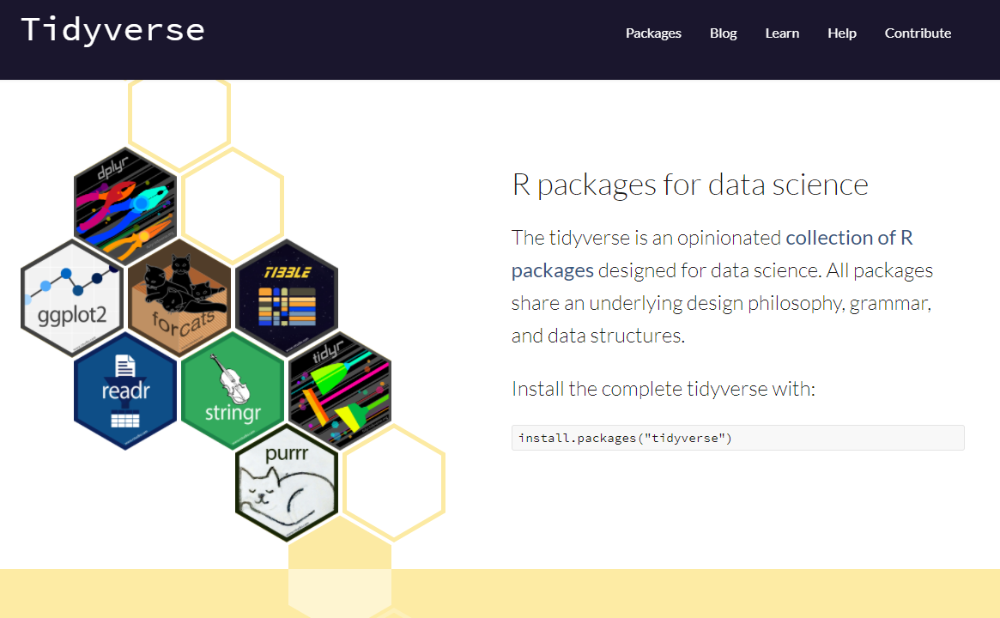
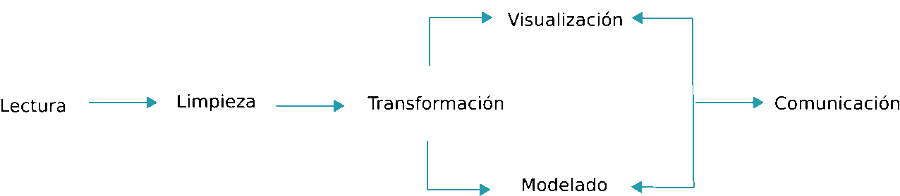

# Tidyverse

 
```{r include=FALSE}
knitr::opts_chunk$set(cache=F, warning=FALSE, message=FALSE)
options(scipen = 0)
```
 
## Introducción

<center>

{width=450px}

</center>

[tidyverse](https://www.tidyverse.org/) es una forma elegante de usar R y hacer de este software una herramienta mejorada. Ha sido diseñado por [Hadley / Rstudio](http://hadley.nz/) e incluye distintas librería que siguen las reglas principales del manifiesto de [The tidy tools](https://mran.microsoft.com/web/packages/tidyverse/vignettes/manifesto.html). Los autores describen esta nueva implementación como:

```tidyverse es un conjunto de librerías que funcionan en armonía porque comparten representaciones de datos comunes y diseño de API. El paquete tidyverse está diseñado para facilitar la instalación y carga de los paquetes principales desde el tidyverse en un solo comando.```


Existen numeros ayudas, cursos y material en general para aprender todo sobre las librerías de tidyverse, pero el autor ha usado el libro [R for Data Science](https://r4ds.had.co.nz/) como base para ilustrar cómo usar este conjunto de herramientas para el análisis de datos en ciencias. Este libro (del que os he puesto el link) es una excelente fuente para aprender todo sobre `tidyverse`. En este capítulo os referenciaré otro material que puede ser de ayuda.

El libro de [R for Data Science](https://r4ds.had.co.nz/) se organiza siguiendo este esquema: 

```{r flujo, echo=FALSE, fig.cap="Esquema R for Data Science", out.width = '100%'}

```

De forma que las librerías incluidas en `tidyverse` cubren todos estos aspectos. Está pensado para facilitar tareas de gestión de datos, y en su caso, el manejo de grandes volúmenes de información de forma eficiente. Se describen técnicas que ayudan a la visualización de datos que es el primer paso que se debe llevar a cabo en cualquier análisis estadístico que se precie. Esta visualización y posterior análisis no sólo deber llevarse a cab o en toda la base de datos, puede requerirse analizar subconjuntos de datos obtenidos mediante algún filtro o inlcuso puede necesitarse recodificar o restructurar la información disponible . Quizás estos sean los procedimientos para los que `tidiverse` mejore de forma sustancial el uso de R tradicional (junto con la forma compacta y clara de escribir código), ya que la posterior modelización puede llevarse a cabo con decenas de librerías diseñadas para tal efecto. 

## Instalación

Para instalar el conjunto básico de liberías relacionadas con `tidyverse` basta con ejecutar_

```{r  eval=FALSE}
install.package("tidyverse")
```

Las librerías básicas relacionadas con `tidyverse` se cargan de la forma usual, con una única llamada

```{r load}
library("tidyverse")
```

La diferencia con el hecho de cargar cualquier otra librería, es que en un sólo comando se instalan/cargan un par de docenas de paquetes. Como beneficio adicional, uno puede estar seguro de que todos los paquetes instalados / cargados son de versiones compatibles.

## Librerías básicas

- Las librerías que son más conocidas y ampliamente utilizadas en `tidyverse` son:

    - **ggplot2**: visualización avanzada de datos
    - **dplyr**: manipulación de datos de forma eficiente y escalable (usa Rcpp)
    - **tidyr**: funciones para ordenar datos
    - **readr**: importa datos.
    - **purrr**: desarrolla una especie de "dialecto" de R que facilita muchas operaciones (map, Reduce, ...)
    - **tibble**: forma moderna para conceptualizar los datos.
    - **magrittr**: canalización para hacer el código más legible (uso del "pipe" %>%)

- Paquetes para manipular formatos de datos específicos:

    - **hms**: leer fácilmente fechas y tiempos
    - **stringr**: funciones para trabajar de forma sencilla con cadenas de carácteres
    - **Lubridate**: Manipulación avanzada de fechas
    - **Forcats**: funciones avanzadas con factores

- Importar datos:

    - **DBI**: define una interfaz común entre R y los sistemas de administración de bases de datos (DBMS)
    - **haven**: importar archivos SPSS, SAS y Stata de forma sencilla
    - **httr**: facilitar el uso del paquete curl personalizado las necesidades de las API web modernas
    - **jsonlite**: análisis y generación de JSON rápido y optimizado para obtener estadísticas en la web
    - **readxl**: leer archivos read.xls y .xlsx de forma sencilla y sin necesitar otras dependencias
    - **rvest**: obtener información de páginas web 
    - **xml2**: trabajar con XML


- Modelización: Existen varias librerías, pero yo prefiero usar las de R y/o Bioconductor


## Manejo de datos

En tidyverse, los data.frames se trabajan como **tibbles**. Esto permite disponer de una forma consistente y eficiente de guardar nuestros datos permitiendo una forma sencilla de hacer transformaciones, visualización y modelización. Esta sección pretende ser una introducción básica a `tidyverse` por lo que sólo veremos cómo llevar a cabo los principales tipos de manipulación de datos. No obstante, también existen funciones específicas para:

* Relacionar múltiples tablas [ver ejemplos](https://rpubs.com/williamsurles/293454).
* Trabajar con variables carácter
* Usar factores para variables categóricas de forma sencilla (sin los problemas de orden de categorías)
* Realizar operaciones con variables de tipo fecha [ver ejemplos](https://rpubs.com/carloslesmes/474297).

### Tibbles

Empecemos introduciendo lo que es un *tibble* (pronunciado "tibel"). Se puede aprender más cosas ejecutando `vignette("tibble")` en la consola de RStudio. Tras cargar la librería `tidyverse` podemos crear un tibble a partir de un data.frame de la siguiente forma. Usaremos la base de datos iris a modo de ejemplo

```{r iris}
head(iris)
```

```{r create_tible}
iris.tib <- tibble(iris)
iris.tib
```

También podemos crear un nuevo *tibble* mediante (los datos se reciclan):

```{r create_new}
tibble(
  x = 1:5, 
  y = 1, 
  z = x ^ 2 + y
)
```

NOTA 1: Nunca cambia los tipos de datos! (i.e. caracter a factor)
NOTA 2: El `rownames` desaparece

Quizás uno de los aspectos más novedosos de las *tibble* sea que se ha re-definido el método `print()` que permite, por defecto, ver las 10 primeras filas y todas las columnas que quepan en la pantalla. Esto puede cambiarse con

```{r change_print}
print(iris.tib, n = 10, width = Inf)
``` 

ó

```{r change_print2}
print(iris.tib, n = 10, width = 25)
``` 

Podemos acceder a una columna (e.g. variable) de la misma forma que con un data.frame

```{r subsetting}
df <- tibble(
  x = runif(5),
  y = rnorm(5)
)

# Extract by name
df$x
df[["x"]]
# Extract by position
df[[1]]
```

## Exercises (tibbles)


1. How can you know whether an object is a tibble? (Hint: try printing mtcars, which is a regular data frame).

2. If you have the name of a variable stored in an object, e.g. var <- "mpg", how can you extract the reference variable from a tibble?

3. What option controls how many additional column names are printed at the footer of a tibble?

4. Practice creating new variables in the following data frame

``` 
         tbl <- tibble(
                  age = c(14, 18, 22, 12, 16, 19, 21, 24),
                  chol = c(172, 180, 185, 170, 175, 188, 190, 192),
                  sex = c("male", "male", "female", "female", "female", "male", "male", "male"
                  )
                )
```

by:
    + Extracting the variable called sex.
    + Plotting a scatterplot of age vs chol.
    + Creating a new column called chol2 which is chol to the power of 2.
    + Rename the columns to one, two and three.


### Importar datos

El paquete clave para leer datos es *readr*


- _read_csv ()_ lee archivos delimitados por comas, _read_csv2 () _ lee archivos separados por punto y coma (común en países donde, se usa como el lugar decimal), _read_tsv () _ lee archivos delimitados por tabulaciones y _read_delim () _ lee archivos con cualquier delimitador.

- _read_fwf ()_ lee archivos de ancho fijo. Se puede especificar campos por sus anchos con _fwf_widths ()_ o su posición con _fwf_positions ()_. _read_table ()_ lee archivos de ancho fijo donde las columnas están separadas por espacios en blanco.

- _read_log ()_ lee archivos de registro de estilo Apache (servidor web de código abierto). Pero también es muy útil *webreadr*, que está construido sobre _read_log ()_ y proporciona muchas más herramientas útiles.

Estas funciones suelen ser mucho más rápidas (~ 10x) que sus equivalentes en R básico. Además, la importación de datos de ejecución prolongada tienen una barra de progreso para que se pueda ver lo que está sucediendo. Si se está buscando velocidad bruta, también podemos usar _data.table::fread()_ que aunque no encaja tan bien en `tidyverse` puede usarse en ocasiones donde precie la velocidad (pero no es mucho más rápido). Los datos se importan como objetos que:

- son *tibbles
- no convierten vectores de caracteres en factores
- no usan nombres de filas ni modifican los nombres de columnas. Éstas son fuentes comunes de frustración con las funciones base R [¡declaración de Hadley!].
- Son más reproducibles. Las funciones de Base R heredan algún comportamiento de su sistema operativo y variables de entorno, por lo que el código para importar datos que funciona en un ordenador, podría no funcionar en el de otra persona.


Hagamos una comparación con un archivo grande

```{r compare}
library(readr)
system.time(dd1 <- read.delim("data/genome.txt"))
system.time(dd2 <- read_delim("data/genome.txt", delim="\t"))
dim(dd2)
```

Efectivamente ambos objetos contienen la misma información

```{r compare_read}
head(dd1)
dd2
```


### Transformación de datos

* It is rare that you get the data in exactly the right form you need. 
* Often you’ll need to create some new variables or summaries.
* Or maybe you just want to rename the variables or reorder the observations in order to make the data a little easier to work with. 

---

Let us illustrate how to manage available data using NYC fligths database. `nycflights13::flights` data frame contains all 336,776 flights that departed from New York City in 2013. The data comes from the US Bureau of Transportation Statistics, and is documented in `?flights`.

```{r load_data}
library(nycflights13)
library(tidyverse)
```

----

```{r show_flights}
flights
```

## dlpyr basics

* Pick observations by their values: `filter()`.
* Reorder the rows: `arrange()`.
* Pick variables by their names: `select()`.
* Create new variables with functions of existing variables: `mutate()`.
* Collapse many values down to a single summary: `summarise()`.

---- 

All verbs work similarly:

- The first argument is a data frame.

- The subsequent arguments describe what to do with the data frame, using the variable names (without quotes).

- The result is a new data frame.

## Filter rows

```{r filter}
jan1 <- filter(flights, month == 1, day == 1)
```

R either prints out the results, or saves them to a variable. If you want to do both, you can wrap the assignment in parentheses:

```{r filter2}
(jan1 <- filter(flights, month == 1, day == 1))
```
## Logical filtering


--- 

```{r example_boolean1}
filter(flights, month == 11 | month == 12)
```

---

```{r example_boolean2}
filter(flights, !(arr_delay > 120 | dep_delay > 120))
```


## Arrange rows

```{r arrange}
arrange(flights, year, month, day)
```

----

```{r arrange2}
arrange(flights, desc(dep_delay))
```
NOTE: missing values are located at the end

## Select columns

```{r select}
select(flights, year, month, day)
```

--- 

```{r select2}
select(flights, year:day)
```

---

```{r select3}
select(flights, -(year:day))
```

---

There are a number of helper functions you can use within select():

*  `starts_with("abc")`: matches names that begin with “abc”.

* `ends_with("xyz")`: matches names that end with “xyz”.

* `contains("ijk")`: matches names that contain “ijk”.

* `matches("(.)\\1")`: selects variables that match a regular expression. This one matches any variables that contain repeated characters. You’ll learn more about regular expressions in `strings`.

* `num_range("x", 1:3)`: matches x1, x2 and x3.

## Add new variables

```{r add_var}
flights_sml <- select(flights, 
  year:day, 
  ends_with("delay"), 
  distance, 
  air_time
)
mutate(flights_sml,
  gain = dep_delay - arr_delay,
  speed = distance / air_time * 60
)
```

----

If you only want to keep the new variables, use `transmute()`:

```{r transmute}
transmute(flights,
  gain = dep_delay - arr_delay,
  hours = air_time / 60,
  gain_per_hour = gain / hours
)
```

## Grouped summaries

```{r summary}
summarise(flights, delay = mean(dep_delay, na.rm = TRUE))
```

--- 

```{r summary2}
by_day <- group_by(flights, year, month, day)
summarise(by_day, delay = mean(dep_delay, na.rm = TRUE))
```

## The pipe `%>%`

Imagine that we want to explore the relationship between the distance and average delay for each location. The steps are:

There are three steps to prepare this data:

* Group flights by destination.

* Summarise to compute distance, average delay, and number of flights.

* Filter to remove noisy points and Honolulu airport, which is almost twice as far away as the next closest airport.


---

Using what you know about `dplyr`, you might write code like this:

```{r pipe}
by_dest <- group_by(flights, dest)
delay <- summarise(by_dest,
  count = n(),
  dist = mean(distance, na.rm = TRUE),
  delay = mean(arr_delay, na.rm = TRUE)
)
delay <- filter(delay, count > 20, dest != "HNL")
delay
```

----

```{r plot_pipe}
ggplot(data = delay, mapping = aes(x = dist, y = delay)) +
  geom_point(aes(size = count), alpha = 1/3) +
  geom_smooth(se = FALSE)
```

----

```{r pipe_use}
delays <- flights %>% 
  group_by(dest) %>% 
  summarise(
    count = n(),
    dist = mean(distance, na.rm = TRUE),
    delay = mean(arr_delay, na.rm = TRUE)
  ) %>% 
  filter(count > 20, dest != "HNL")
delays
```

## Group by different variables

```{r group_var}
flights %>%
  group_by(year, month, day) %>% 
  summarise(
    avg_delay1 = mean(arr_delay, na.rm=TRUE),
    avg_delay2 = mean(arr_delay[arr_delay > 0], na.rm=TRUE) 
  )
```

## Useful summary functions

* `count()`
* `mean()`
* `median()`
* `min()`
* `max()`
* `quantile(x, 0.25)`
* `IQR()`
* `mad()`


## Exercises (data transform)

1. Using `flights` dataset, find all flights that
     - Had an arrival delay of two or more hours
     - Flew to Houston (IAH or HOU)
          - Arrived more than two hours late, but didn’t leave late
     - Were delayed by at least an hour, but made up over 30 minutes in flight
     
2. Another useful dplyr filtering helper is between(). What does it do? Can you use it to simplify the code needed to answer the previous challenges?

3. Sort flights to find the fastest flights.

4. Create a new data frame having variables with the `dep` string.

5. Create a new data frame having the hour and minute of depature (Hint: information is in the variable `dep_time` with format HHMM or HMM. Use `%/%` or `%%` when appropriate) 

6. Create a summary of each airline (variable `carrier`) describing the total number of flights, the average, median, IQR and variance delays. Which is the best airline in terms of those summary statistics?
