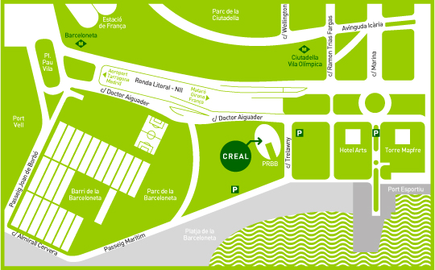

# Biotools in biostatistics and bioinformatics

Repository with the material corresponding to the course __Biotools in biostatistics and bioinformatics__ given at 
[ISGlobal](http://www.isglobal.org) (former CREAL). Each folder contains slides, R code, data and exercises of each topic.

## License
 
Unless otherwise stated, all material is licensed under a
[Creative Commons Attribution-ShareAlike 3.0 License](http://creativecommons.org/licenses/by-sa/3.0/).
This means you are free to copy, distribute and transmit the work,
adapt it to your needs as long as you cite its origin and, if you do
redistribute it, do so under the same license.

# Introducción y Objetivos
El curso es una respuesta a la necesidad de investigadores en bioestadística y bioinformática de aprender a manejar herramientas básicas para ser profesionales y eficientes a la hora de programar, crear y distribuir sus trabajos creados, básicamente, en R. El cuso está diseñado para investigadores que utilizan R en su trabajo diario y quieren: 

> * Aprender a programar de forma eficiente nuevos métodos estadísticos y bioinformáticos y crear librerías optimizadas. 
> * Aprender a documentar librerías mediante métodos que garanticen la investigación reproducible (Knitr, Markdown).
> * Saber cómo implementar dichas librerías de forma colaborativa usando herramientas que permiten el control de versiones (GitHub).
> * Aprender a crear interfaces gráficas (GUIs) mediante Shiny para extender el uso de los métodos implementados a usuarios no familiarizados con R, o en general programas que requieren escribir comandos. Por ejemplo, grupos que no disponen de programadores, bioinformáticos y/o bioestadísticos.
> * Saber cómo publicar sus librerías en repositorios públicos como CRAN y/o Biooconductor (también GitHub) que garanticen la máxima disponibilidad de sus métodos por otros grupos

# Dirigido a
Estudiantes, profesores e investigadores con conocimientos básicos de programación, que deseen utilizar este entorno para crear librerías que implementen métodos nuevos que hayan desarrollado o flujos de trabajos (pipelines) que permitan analizar sus datos mediante otras librerías o funciones ya existentes. 

Para obtener un mejor provecho del curso, es necesario tener cierta experiencia escribiendo funciones, aunque sean sencillas. Los participantes aprenderán en profundidad las técnicas de programación que están disponibles para R, así como crear sus propias librerías para ser enviadas a repositorios como CRAN o Bioconductor. El curso pretende mejorar tanto la estrategia como la programación de funciones de forma que el desarrollo de nuevos métodos estadísticos puedan ser utilizados por el mayor número de usuarios de forma sencilla y eficaz. 

# Metodología del curso
Las sesiones serán de 2 horas. La primera media hora servirá para introducir a los participantes en un tema concreto. La siguiente media hora consistirá en un ejemplo basado en un problema real que servirá para ilustrar el tema tratado. La siguiente hora consistirá en un ejercicio que los participantes deberán resolver y que será comentado y resuelto tras su finalización. Los participantes dispondrán de las diapositivas del curso y el código utilizado tanto en la presentación como para resolver los ejercicios resueltos. 

# Fechas y horario
Las fechas del curso serán el 16, 17 y 18 de Mayo y se realizará en el Instituto de Salud Global Barcelona, ISGlobal - Campus Mar ( www.isglobal.org ) [antiguo CREAL - www.creal.cat] situado en el Parque de Investigación Biomédica de Barcelona  (www.prbb.org ). El número de plazas para el curso está limitado a 20 y las plazas se han adjudicado ESTRICTAMENTE por orden de llegada de pre-inscripción, enviando un e-mail a  gemma.punyet@isglobal.org y posteriormente rellenando el [formulario de pre-inscripción]( https://docs.google.com/forms/d/e/1FAIpQLSeY0v5l7gbze0CEBlR5gx33A69dyk7uNk4KJZxcE8DtXje-Gw/viewform?usp=sf_link) 

El horario del curso es el siguiente:
Mañanas: de 9:00 a 13:30h / Tardes: de 15:00 a 18:00h

# Temario
**Día 1: Programación en R, creación de librerías y creación de documentos con Rmarkdown.**

Parte I - Programación en R  (2 horas)
- Creación de nuevas funciones
- Cómo organizar una función 
- Nombres de argumentos y valores por defecto
- Control de los argumentos
- Uso de 'formula'   

Parte II - Métodos y clases en R (2 horas)
- Programación orientada a objetos
- Creación de Métodos
- Creación de Clases

Parte III - Creación de una librería (1 horas)
- Estructura básica

Parte IV - Investigación reproducible (2 horas)
- Creación de documentación
- Knitr
- Markdown
- Envío a CRAN o Bioconductor.

**Día 2: Creación de interfaces gráficas con Shiny**

Parte I  
-  Introducción: instalación de Shiny y primeros ejemplos (1 horas)

Parte II 
- Diseño del formulario de la aplicación: disposición de los elementos (Sección UI) (1'5 horas)

Parte III 
- Lógica de Shiny: cómo funciona (Sección Server). (1'5 horas)

Parte IV  
- Cómo mejorar el aspecto y la funcionalidad de la aplicación mediante paquetes complementarios a Shiny: shinyBS, shinythemes, shinyjs. (1 hora)

Parte V 
-  Práctica: creación de una aplicación. (2 horas)

**Dia 3: Manejo de repositorios**

Parte I - Github Básico
- ¿Qué es un sistema de control de versiones?
- GitHub - Presentación
- Creación de una cuenta en GitHub y del primer repositorio
- Interfaz GitHub desktop y/o GitKraken

Parte II - GitHub Avanzado
- Comandos básicos (status, add, rm, commit y push)
- Comandos avanzados (stash, rollback)
- Creación de ramas (branches)

# Material y Requisitos
Los alumnos deberán traer sus propios portátiles. Dicha aula tendrá acceso WiFi a Internet y los alumnos dispondrán de acceso previo a todo el material del curso que incluye las librerías, el código R y los datos necesarios para seguir las clases y realizar los ejercicios. 

El curso utilizará dos herramientas principales: Rstudio y Github. Todos los participantes deberán tener instalado una semana antes del curso la version de Rstudio 1.0.136 ( https://www.rstudio.com/ ) y la interfaz de Github desktop (Windows: https://desktop.github.com/, Linux: https://www.gitkraken.com/ ) . No hace falta tener una cuenta en Github porque aprenderemos a crearla en el curso (si ya la tiene no hay problema). Durante esa semana anterior al curso, se enviará unas instrucciones para que todos los alumnos tengan una misma configuración y puedan seguir las clases de forma eficiente. 

# Profesorado
Juan R González, Responsable del Grupo de Investigación en Bioinformática en Epidemiología Genética (BRGE) del Instituto de Salud Global Barcelona (ISGlobal) y Profesor Asociado al Departamento de Matemáticas de la Universidad Autónoma de Barcelona (UAB).

Isaac Subirana, Técnico Investigador en el Grupo REGICOR (IMIM-Parc de Salut Mar) y Profesor Asociado en el Departamento de Estadística de la Facultad de Biología de la Universidad de Barcelona (UB).

Carles Hernández-Ferrer, Investigador pre-doctoral del BRGE del Instituto de Salud Global Barcelona (ISGlobal).

# Coste del curso y forma de pago
El coste del curso es de 340 euros que incluye el desayuno que se realizará a mitad de la mañana así como todo el material del curso en soporte electrónico (funciones, librerías y ejercicios resueltos) las diapositivas y material bibliográfico presentado en las clases.  El número de alumnos será de un máximo de 20. Los socios del [Barcelona Bioinformatics (BIB)](http://www.bioinformaticsbarcelona.eu/) tendrán un descuento del 10% pero sólo a los dos primeros miembros que lo soliciten. El resto si quieren asistir al curso deberán abonar el coste total.

Una vez confirmada la inscripción al curso, se deberá realizar el pago a  través de transferencia bancaria, al número de cuenta CAIXABANK, S.A numero ES79 2100 0801 1102 0052 1586. Una vez realizado el ingreso el alumno tendrá que enviar el comprobante de la transferencia a gemma.punyet@isglobal.org 

# Acceso al Campus Mar - ISGlobal (PRBB) 
El Instituto de Salud Global Barcelona (ISGlobal) se encuentra en el Parque de Investigación Biomédica de Barcelona (PRBB) situado en la calle Doctor Aiguader, 88 de Barcelona, en la primera planta del PRBB, delante del Paseo Marítimo de Barcelona, entre el Hospital del Mar y el Hotel Arts de la Villa Olímpica. 

 

Se puede llegar a través de varias vías. Si necesitáis más información podéis consultar la web de Transportes Metropolitanos de Barcelona ( www.tmb.net ).

Paradas de Metro cercanas al centro: Línea 4 (amarilla) Barceloneta y Ciutadella.

