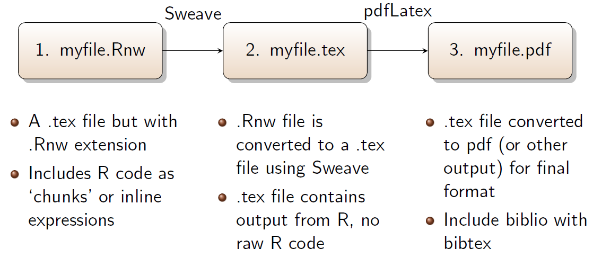
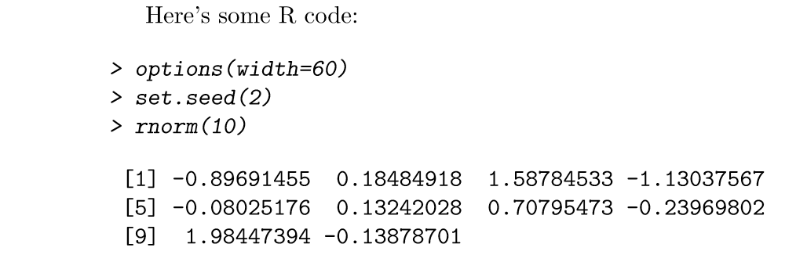

<!-- to compile this:
library("rmarkdown");
render("rr-auhtoring.Rmd", output_format="all")
or just call make
-->

```{r style, echo=FALSE, message=FALSE, warning=FALSE, results="asis"}
library("knitr")
#options(width=100)
opts_chunk$set(message = FALSE, error = TRUE, warning = TRUE)
```


# Reproducible research (RR)

- In it's most general sense... the ability to reproduce results from an experiment or analysis conducted by another.

- From Wikipedia... `The ultimate product is the **paper along with the full computational environment** used to produce the results in the paper such as the code, data, etc. that can be **used to reproduce the results and create new work** based on the research

- Concept is strongly based on the idea of **literate programming** such that the logic of the analysis is clearly represented in the final product by combining computer code/programs with ordinary human language [Knuth, 1992].

## Example of non-reproducible research
1. Gather data
 - Begins with general question or research objectives
 - Data collected in raw format (hard copy) converted to digital (Excel spreadsheet)
2. Analyze data
 - Import data into stats program or analyze directly in Excel
 - Create figures/tables directly in stats program
 -  Save relevant output
3. Report Result
 - Create research report using Word or other software
 - Manually insert results into report
 - Change final report by hand if methods/analysis altered

## Example of reproducible research
1. Gather data
 - Begins with general question or research objectives
 - Data collected in raw format (hard copy) converted to digital **text file**
2. Analyze data 
 - Create **integrated script** for importing data (data path is known)
 - Create figures/tables directly in stats program
 - **No need to export** (reproduced on the fly)
3. Report Result
 - Create research report using RR software
 - **Automatically include results** into report
 - **Change final report automatically** if methods/analysis altered

Easily adopted using [RStudio](http://www.rstudio.com/). Also possible with [Tinn-R](https://sourceforge.net/projects/tinn-r/) or via command prompt but not as intuitive.
Requires a \LaTeX\ distribution system - use [MikTex for Windows](http://miktex.org/). It is essentially a
\LaTeX\ document that incorporates R code and these programs use Sweave (or Knitr) to convert .Rnw file 
to .tex file, then \LaTeX\ is used to create pdf files. The workflow is then:




**.Rnw file **

```
\documentclass{article}
\usepackage{Sweave}
\begin{document}
Here
s some R code:
<<eval=true,echo=true>>=
options(width=60)
set.seed(2)
rnorm(10)
@
\end{document}
```

**.tex file**

```
\begin{document}
  
  Here's some R code:
  
  \begin{Schunk}
  \begin{Sinput}
  > options(width=60)
  > set.seed(2)
  > rnorm(10)
  \end{Sinput}
  \begin{Soutput}
  [1] -0.89691455  0.18484918  1.58784533 -1.13037567 
  [5] -0.08025176  0.13242028  0.70795473 -0.23969802 
  [9]  1.98447394 -0.13878701
  \end{Soutput}
  \end{Schunk}
  
  \end{document}
```

**.pdf file** (final product)



# Code chunks

R code is entered in the \\LaTeX\\ document using *code chunks*
  
```
<<>>=
R code  
@
```
  
Any text within the code chunk is interpreted as R code.  Arguments for the code chunk are entered 
within `<<here>>`. These are available arguments:
  
  - `eval`: evaluate code, default TRUE
  - `echo`: return source code, default TRUE
  - `results: format of output (chraracter string), default is `include` (also `tex`` for tables 
               or `hide` to suppress)}
  - `fig`: for creating figures, default FALSE
  
**examples of code chunks**

This chunk
```
<<>>=
2+2
@
```
will return
```{r}
2+2
```

The option `echo=FALSE` indicates that the code will not be shown in the final document (though any results/output would still be displayed). This chunk
```
<<echo=FALSE>>=
2+2
@
```
will return
```{r, echo=FALSE}
2+2
```
The option `results="hide"` will hide the results/output (but here the code would still be displayed). This chunk
```
<<results='hide'>>=
2+2
@
```
will return
```{r, eval=FALSE}
2+2
```
The use of `include=FALSE` states that the chunk is evaluated, but neither the code nor its output displayed. This chunk
```
<<include=FALSE>>=
2+2
@
```
will return
```
... nothing
```

There are lots of different [possible "chunk options"](https://yihui.name/knitr/options/#chunk_options). Each must be real R code, as R will be used to evaluate them. 

##Figures

If one is interested in writing a report for a collaborator who is not familiar with R, it can be useful to use `include=FALSE` to suppress all of the code and largely just include figures.

For figures, you'll want to use options like `fig.width` and `fig.height`. For example:

```
<<myfig, fig=TRUE, fig.width=8, fig.height=6}>>
plot(x,y)
@
```
Relevant code options for figures:

- The chunk name is used to name the figure, myfile-myfig.pdf}
- fig: Lets R know the output is a figure
- echo: Use `FALSE` to suppress figure code
- include: Should the figure be automatically include in output
- height: (and `width`) Set dimensions of figure in inches


##Tables

Let us include a table by using the dataset `women` that is included by default in R. 

```
<<women>>=
require(xtable)
myTable <- summary(women)
@
```

The simplest way is to use `xtable` package. 

```
<<xtable1, results='tex'>>=
xtab <- xtable(myTable)
print(xtab, floating=FALSE)
@
```

Tables can be improved by, for instance, excluding the number of rows or adding a caption. We can reference this table
by inserting  in the .Rnw file: `Table~\ref{Table:women}`.


```
<<xtable2, results='tex'>>=
xtab2 <- xtable(myTable, caption="Summary of women data",  label="Table:women")
print(xtab2, include.rownames = FALSE)
@
```

## Time consuming chunks
In those cases where computing time is large `cache` option can be used 

```
<<cache, cache=TRUE>>=
dd <- rnorm(1000000, nrow=100, ncol=10000)
ans <- apply(dd, 2, mean)
@
```

## Global chunk options

You may be inclined to use largely the same set of chunk options throughout a document. But it would be a pain to retype those options in every chunk. Thus, you want to set some global chunk options at the top of your document.

For example, one might use `include=FALSE` or at least `echo=FALSE` globally for a report to a scientific collaborator who wouldn't want to see all of the code. And one might want something like `fig.width=12` and `fig.height=6` if one generally want those sizes for his/her figures. These options can be set by having an initial code chunk like this:

```
<<global_options, include=FALSE>>=
knitr::opts_chunk$set(fig.width=12, fig.height=8, fig.path='Figs/',
                      echo=FALSE, warning=FALSE, message=FALSE)
@                      
```

There are a few additional options in there: `warning=FALSE` and `message=FALSE` suppress any R warnings or messages from being included in the final document, and `fig.path='Figs/'` makes it so the figure files get placed in the Figs subdirectory. (By default, they are not saved at all.)

**Note**: the ending slash in `Figs/` is important. If you used `fig.path='Figs'` then the figures would go in the main directory but with Figs as the initial part of their names.

The global chunk options become the defaults for the rest of the document. Then if you want a particular chunk to have a different behavior, for example, to have the R code to produce a given result, you'd specify a different option within that chunk. For example:

```
<<analysis, echo=TRUE>=
sweep(dd, 2, FUN="\", ans)
@
```

## In-line code

A key motivation for knitr is [reproducible research](https://en.wikipedia.org/wiki/Reproducibility#Reproducible_research): that our results are accompanied by the data and code needed to produce them.

Thus, your report should never explicitly include numbers that are derived from the data. Don't write "There are 168 individuals." Rather, insert a bit of code that, when evaluated, gives the number of individuals. That's the point of the in-line code. You'd write something like this:

```
There are \Sexpr{nrow(my_data)}` individuals
```

# References

This material has been inspired in the slides prepared by Marcus W. Beck, USEPA NHEERL and some material by Karl Broman.

Here you have a [reference card](https://cran.r-project.org/web/packages/knitr/vignettes/knitr-refcard.pdf).


# Session information

```{r, echo=FALSE}
sessionInfo()
```

 
