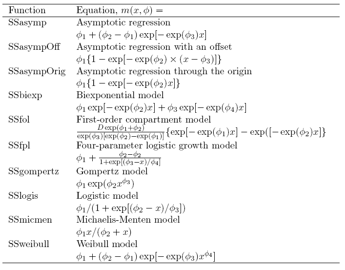

<!-- to compile this:
library("rmarkdown");
render("rr-auhtoring.Rmd", output_format="all")
or just call make
-->

```{r style, echo=FALSE, message=FALSE, warning=FALSE, results="asis"}
library("knitr")
#options(width=100)
opts_chunk$set(message = FALSE, error = TRUE, warning = FALSE)
```


# Introduction

> **Objectives**
>
> * Learn how to model longitudinal data using non-lineal models.
> * Peform data analyses where the scientific question is to determine the non lineal association between longitudinal data and a continuous outcome.

# Introduction

- Non lineal models generalize linear regression models when the mean conditioned to the response variable is a non lineal function on the parameters.

- In some situations, it is enough to transform either the outcome or the predictors and use lineal models.

- This approach works in many situation. However, the problem arises when interpreting model parameters. 

- Therefore, if our aim is to determine those variable that are associated with the outcome, this approach is a good option. On the other hand, is our aim is to interpret model parameters, non lineal methods have to be used instead. 

Let us illustrate this situation with a real  data example. Next figure depicts the linear relationship between US population and different years (i.e. longitudinal data)

```{r, example}
library(car)
mod <- lm(population ~ year, data=USPop)
plot(population ~ year, data=USPop)
abline(mod)
```

We clearly observe that assuming a linear relationship is not fitting properlly our data. One option may be to look for a transformation that guarantees linear association. This can be perform as following:

```{r, transform}
trans <- powerTransform(mod)
trans
```

The function `powerTransform` from `car` packages indicates that cubic root may be a good transformation (3 ~ 1/0.3449). Then, the linear analysis can be performed by using this transformation by executing:

```{r, linearization}
population.trans <- bcPower(USPop$population,
                       coef(trans, round=TRUE))

mod.trans <- lm(population.trans ~ year, data=USPop)
plot(population.trans ~ year, data=USPop)
abline(mod.trans)
```

Now the lineal relationship between the transformed variable and the year is very clear. However, model parameters are hard to be interpreted. The idea behing the non lineal models is that, when the non linear relatioship is known, model parameters can be estimated and, hence, interpretation can be facilitated. In general, we can estimate the relationship

$$ y = m(x, \pmb{\theta}) + \epsilon $$

where $m$ can be any function. In our example, we can use the _growth logistic model_ that can be expressed as: 

$$ m(x, \pmb{\theta}=(\theta_1, \theta_2, \theta_3) = \frac{\theta_1}{1 + 
     \exp[-(\theta_2 + \theta_3 x)]} $$
     
Here, 

- Changing the parameters $\pmb{\theta}=(\theta_1, \theta_2, \theta_3)$ we can set axes limits

- The velocity how curve is varying between lower and upper limits can also be set. For instance, if $\theta_3 > 0$ then when $x$ increases the term $\exp[-(\theta_2 + \theta_3 x)]$ tends to 0. Therefore $m(x, \pmb{\theta})$ will approximate to $\theta_1$ as its asymptote. In other words, we assume a maximum population size

- The parameter $\theta_3$ controls how fast is the transition of the curve between 0 and  $\theta_1$. This parameter is known as the growth rate. 
     
This plot shows the expected curve when all parameters are set to 1. 

```{r, curve}
curve(1/(1+exp(-(-1 + 1*x))), from=-5, to=5)
abline(h=1/2, lty=2)
abline(v=1, lty=2)
```

# Model parameter estimates

We can estimate $\pmb{\theta}$ minimizing the sum of the square residuals

$$S(\pmb{\theta}) = \sum w[y-m(x, \pmb{\theta})]^2$$

To this end, the next iterative process must be performed: 

- Provide intial values of $\pmb{\theta}$. This step can be crucial. There are methods to provide _reasonable_ start values. There are _self-starting_ functions in `R` to do this task. 

- The iteration $j \ge 1$ gives a solution  $t_j$ updating $t_{j-1}$. If $S(t_j)$ is lower thatn $S(t_{j-1})$ given a tolerance, then  $j$ is augmented in one unity and the previous step is repeated. If not, the solution in $t_{j-1}$ is considered the estimator. 

This algorith must hold:

- The method has to provide a lower value of $S$ at each step. There are several algorithms to perform this (see [Bates and Watts]()). One of them is to use an algorithm based on Gauss-Newton method estimating derivatives at each step using numerical methods (e.g. quasi-Newton). 

- The $S$ function can have several solutions and the algorithm may get a local minima. One strategy to avoid this problem can be to start by using several initial points and check whehter they converge to the same answer. 

- In some ocassions the process may provide solutions that improve $S$ and the process may be long. This can be overcame by fixing a maximum number of iterations. This may provide a local minima and should be carefully checked. 

In `R`there exists a function called `nls` that has implemented these methods. 

```{r, nls}
args(nls)
```

And the parameters to control the algorithm (e.g. maximum number of iterations, tolerance, ...) are: 

```{r, control}
args(nls.control)
``` 

The initial value of each problem must be considered independently. In our case, in the logistic model it can be seen that: 

\begin{subequations}
\begin{align}
y& \approx \frac{\theta_1}{1 + \exp[-(\theta_2 + \theta_3 x)]}\\
y/\theta_1 & \approx \frac{1}{1 + \exp[-(\theta_2 + \theta_3 x)]}\\
\log \left[ \frac{ y/\theta_1} {1 - y/\theta_1 }   \right] & \approx \theta_2 + \theta_3 x
\end{align}
\end{subequations}

In this case, it is enough to know the intial value of $\theta_1$. We know that this parameter corresponds to the upper asymptote (maximum number of individuals in the population in our example). 400 seems to ve a reasonable value taking into account that the estimated pupulation in 2010 was 307 million inhabitants. The previous equation can be solved by:

```{r, initial}
lm(logit(population/400) ~ year, USPop)
```

Therefore, our vector of initial values (`start` argument) could be $\pmb{\theta_1} = (400, -49, 0.025)$. The non lineal model is fitted in `R` by:

```{r, model}
mod.nl <- nls(population ~ theta1/(1 + exp(-(theta2 + theta3*year))),
 start=list(theta1 = 400, theta2 = -49, theta3 = 0.025),
 data=USPop, trace=TRUE)
summary(mod.nl)
```

In these type of models there is a very relevant measurement. We are normally interested in knowing where the mean value of the asymptote of variable _y_ is located. In our example, this corresponds to the year where the half of the maximum population will be observed. 

In the dosage-response studies where the effect of a drug is studied, this value is know as the *median dosage* and it provides the value of the dosage where half of the inviduals die. This is know as $IC_{50}$ value.

It can be estimated as $-\hat{\theta_2}/\hat{\theta_3}$. In our case 

```{r, ic50}
-coef(mod.nl)[2]/coef(mod.nl)[3]
```

that can be interpreted as the year where the population will reach its maximum value. Notice that this value would indicate the moment where half of population is still alive when analyzing mortality models.

The standard error of IC50 can be estimated by means of the delta method. NOTE: for teh univariate case this corresponds to $\mbox{Var}(g(\theta_1)) = \sigma^2_{\theta_1} g'(\theta_1)^2$. However this cannot be applied in our case since IC50 is computed by using $\theta_2$ and $\theta_3$. In `R` the delta method can be computed by

```{r, delta}
deltaMethod(mod.nl, "-theta2/theta3")
```
 
We can verify that this model is correct to make predictions

```{r, pred}
 plot(population ~ year, USPop, xlim=c(1790, 2100), ylim=c(0,450))
 with(USPop, lines(seq(1790, 2100, by=10),
  predict(mod.nl, data.frame(year=seq(1790, 2100, by=10))), lwd=2))
 points(2010, 307, pch="x", cex=1.3)
 abline(h=0, lty=2)
 abline(h=coef(mod.nl)[1], lty=2)
 abline(h=.5*coef(mod.nl)[1], lty=2)
 abline(v= -coef(mod.nl)[2]/coef(mod.nl)[3], lty=2)
```

In `R` some of the most commonly used non lineal functions are already implemented. This is the case of logistic growth model that is implemented in the function `SSlogis` as described [Pinheiro and Bates](). This function can be used in our example as following:

```{r, sslogis}
mod.ss <- nls(population ~ SSlogis(year, phi1, phi2, phi3), data=USPop)
summary(mod.ss)
```

The problem is that we must know how model is parameterized. In this case as  $-\hat{\theta_3}/\hat{\theta_2}$ is an important measurement, the function is parameterized by
$\phi_1=\theta_1$, $\phi_2= - \theta_2 / \theta_3$, $\phi_3= 1/\theta_3$. We have

$$ m(x, \pmb{\phi}=(\phi_1, \phi_2, \phi_3)) = \frac{\phi_1}{1 + 
     \exp[-(x - \phi_2) / \phi_3)]} $$

We can verify as both methods are providing the same solution

```{r, check}
summary(mod.ss)
deltaMethod(mod.nl, "1/theta3")
```

These are the non linear models that are implemented in `R`





# Model with covariates

In many occassions we are interested in estimating a non lineal model with the same function for different groups of data. For instance, one may be interested in comparing population from Canada and US. 

```{r,combina}
datos <- data.frame(rbind(data.frame(country="US", USPop[,1:2]),
                data.frame(country="Canada", CanPop)))
some(datos)
```

We can visualize the data as following (NOTE: lines are estimated using non parametric methods)

```{r, plot_combina}
scatterplot(population ~ year|country, data=datos, 
      box=FALSE,  reg=FALSE)
```

We can estimate a logistic growth model separately of each group by using the library `nlme`. The function `nlsList` assumes the same variance of the errors in all groups. However, in our example, the variability observed in US is larger than in Canada. To force different variances, the argument `pool` must be set to `FALSE`. 

```{r, nlm_groups}
library(nlme)
mod.list <- nlsList(population ~ SSlogis(year, phi1, phi2, phi3)|country,
                     data=datos, pool=FALSE)
summary(mod.list)
````

We can use the function `deltaMethod` to compute the standard error of the difference between the growth rate between both countries. To this end, we must consider that the object `mod.list` is a list of objects of class `nls`:

```{r, coefs_nls}
phis <- unlist(lapply(mod.list, coef))
phis
```

Their variances and covariances can be obtained by:

```{r, var_cov}
vars <- lapply(mod.list, vcov)
vars
```

We can create the matrix of variances and covariances like this:

```{r, var_cov_mat}
zero <- matrix(0, nrow=3, ncol=3)
var <- rbind( cbind(vars[[1]], zero), cbind(zero, vars[[2]]))
var
```

And we can perform a formal comparison of any parameter by:

```{r, diff}
deltaMethod(phis, "US.phi3 - Canada.phi3", vcov=var)
deltaMethod(phis, "US.phi2 - Canada.phi2", vcov=var)
```


# Exercise (to deliver)

---------------------

**Exercise 1:** 

In biochemistry, the kinetic model of Michaelis-Menten is used to analyzed enzyme kinetics. This model relates the rate reaction $v$ with the sustrate concentration $S$ by means of the equation:

$$ v = \frac{\phi_1 S}{\phi_2 + S} $$

where $\phi_1$ corresponds to the maximum reaction rate achieved by the system (saturating value) and $\phi_2$ (known as Michaelis constant) corresponds to the concentration where reaction rate is half of $\phi_1$. This parameter $\phi_2$ is highly relevant to the biologists. 

- Draw the theoretical curve then $\phi_1=3.5$ y $\phi_2=0.4$ of a range of contentration values between 0 and 5. 

- The file `kinetics.txt` contains information of a experiment carried out to estimate the concentration at which the reaction rate is half of it maximum. Use the Michaelis-Menten model to estimate this parameter and its confidence interval (CI) at 95% (NOTE: investigate whether there is any generic `R` function to automatically compute the CI).

**Exercise 2:** 

The file `ic50.txt` contains information about cellular growth accross time (variable _tiempo_) of three different exposures (variables _low_, _medium_, _high_).

- Create a plot comparing the three growth curves

- Calculate  the _ic50_ (time at which half of the maximum cellular grotwh is achieved) for the three types of exposure by using the model you think that best approximate the data. Is there statistically significant differences between those values?

- Create a plot with observed and predicted values and verify whether the model you have used fit the data. 

- Which type of exposure has the larger growth rate?


---------------------
 

# References

- The [`nlme`] package (https://cran.r-project.org/web/packages/nlme/)

- Bates and Watts (1998). Nonlinear Regression Analysis and Its Applications. Wiley, New York.

- Pinheiro, J. C. and Bates, D. M. (2000). Mixed-effects Models in S and S-PLUS. Springer, New York.


# Session information

```{r, echo=FALSE}
sessionInfo()
```

