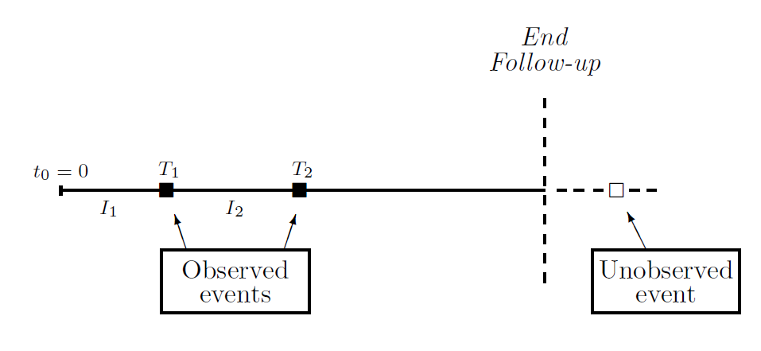
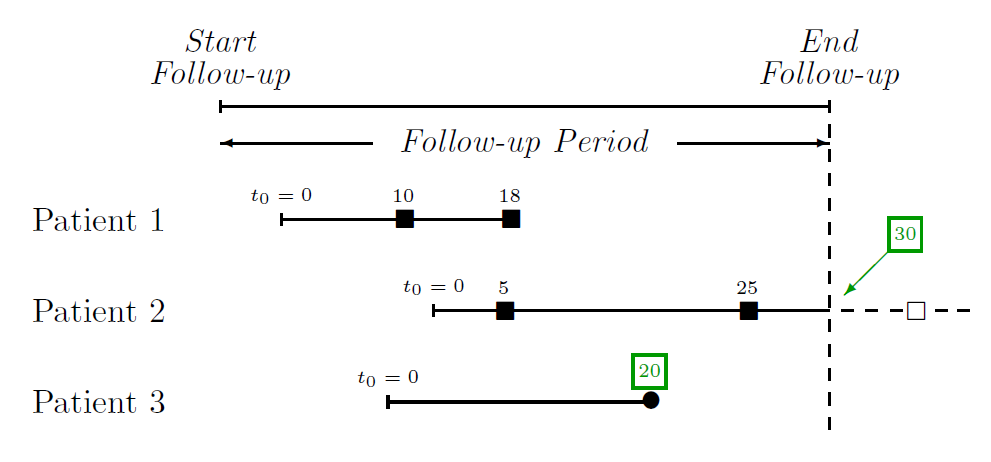
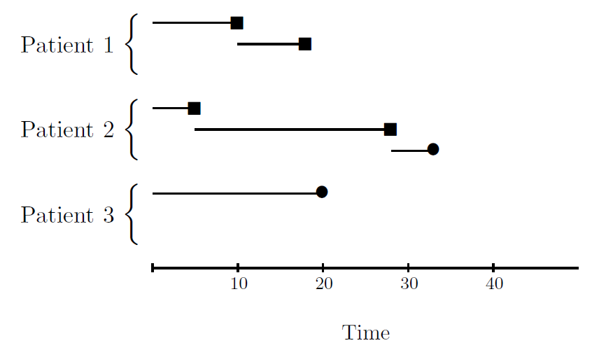
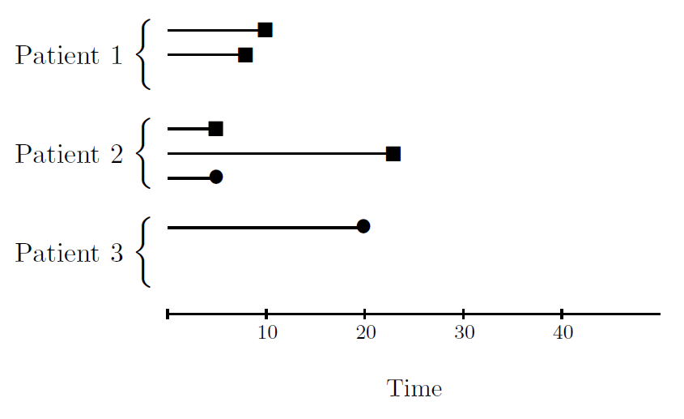
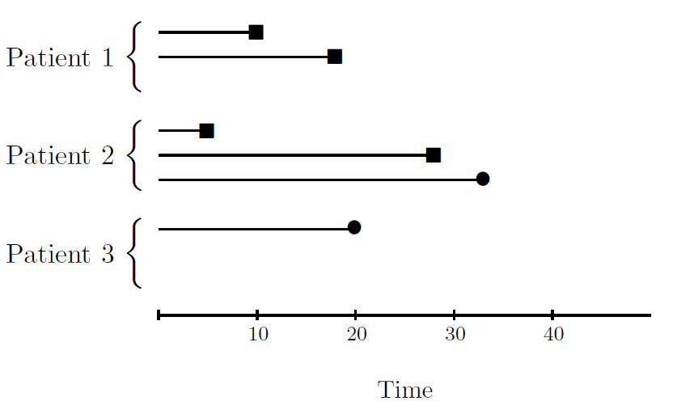

<!-- to compile this:
library("rmarkdown");
render("rr-auhtoring.Rmd", output_format="all")
or just call make
-->

```{r style, echo=FALSE, message=FALSE, warning=FALSE, results="asis"}
library("knitr")
#options(width=100)
opts_chunk$set(message = FALSE, error = TRUE, warning = FALSE)
```


# Introduction

> **Objectives**
>
> * Understand the concept of survival analysis with recurrent event data
> * Learn how to perform survival analysis with recurrent event data extending the Cox proportional hazard models
> * Peform data analyses where the scientific question is to determine factors associated with time until re-ocurrences of a repeated event considering different covariates and taking into account event dependence and heterogeneity accross individuals


# Multiple events per subject

In some situations in which the event of interest is not death, a patient may experience the event of interest several times over follow-up. Examples of recurrent event data could be: multiple heart attacks of coronary patients, recurrent infections in AIDS patients, multiple episodes of relapses from remission or when a patient is repeatedly readmitted in a hospital. The main feature of this kind of data is that the events are naturally ordered and are observed in a particular sequence over time, so we observe the event of interest at different times during the follow-up period. But, the last event could be not observed before the end of follow-up and in this way, we have the common feature of survival data: _censored data_.

This figure shows a graphical example of recurrent event data. Let us suppose that it is a patient with Chronic Obstructive Pulmonary Disease (COPD) data set described in the previous lecture  ....


 
# Time scales

The repeated nature of a given event may produce that a subject may experience, for instance, as illustrated in the COPD example, a hospital admission several times over follow-up period. When outcome events may occur more than once over the follow-up period for a given subject, we refer as _recurrent event data_. The objective for such data is to assess the relationship of relevant predictors to the rate in which events are occurring, allowing for multiple events per subject. Many extensions of survival models based on the Cox proportional hazards approach have been proposed to handle multiple event data. A major issue to extending proportional hazards regression models to this situation of multiple events is _intrasubject correlation_.

We consider counting process methods for analyzing time-to-event data with multiple or recurrent outcomes, using the models developed by [Andersen and Gill]() and [Prentice, Williams and Peterson](), called marginal models. They are approaches proposed for adapting the Cox model to this setting that work well with our data. But we also describe alternative approach that use a \emph{frailty model}. This last model includes a random per-subject effect that describes excess risk or \emph{frailty} that will be further explain in another lecture.

One important aspect of multiple event data models is the time scale. Three formulations are available: gap time, total time and counting process formulation. Next figure illustrates how recurrent event data is obtained in a hypothetical study. This example will be used to describe how these three time scales are obtained.  Noteice that time scale is important in multiple events analysis because defines when a subject is at risk of having an event.




This example depicts how three patiens are recorded in the data file. When follow-up period starts for a patient, it is indicated by $t_0=0$; \scriptsize{$\blacksquare$} encodes the occurrence of an event and} \large{$\bullet$} correspond to censoring. Patient--1 has two events, ending the period of observation with an event; patient--2 has one event before being censored; patient--3 has no events before being censored. The first step in fitting the models is to build an adequate database. The key to construct the dataset depends on the time scale selected. Let us consider the three patients in our hypothetical example to describe the three different time scales.

\clearpage

## Counting process

Counting process  is represented as a series of observations (rows of data) with time intervals of (entry time, first event], (first event, second event],....,($k$th event, last follow-up]. This is represented in the next figure



\clearpage

## Gap time

Gap time is the time from the last event or entry, with intervals of  $(0,t_1],(0,t_2-t_1],\cdots$. The model assumption in this case is that the gap times form a renewal process. This is represented, for our hypothetical study, in the next figure



\clearpage

## Total time

Total time corresponds to the time from the start of follow-up.  This is represented, for our hypothetical study, in the next figure



A main feature for recurrent event data is that events are naturally ordered and are observed in a particular sequence over time as we have shown in the example above. However we can distinguish between multiple events of the same type (multiple hospital admissions)  or multiple events of different type (hospital admission and death). The second situation will be address in another lecture.

\clearpage

# Extensions of the Cox model.

The modeling of the marginal distribution for the \emph{k}th hospital admission is based on the Cox proportional hazards model. Under this model the hazard for each \emph{k}th event of the \emph{i}th subject takes one of the following two forms:

\begin{equation}\label{AGriesgok}
\lambda_k(t;Z_{ik})=\lambda_0(t)e^{\beta'Z_{ik}(t)}
\end{equation}

\begin{equation}\label{PWPriesgok}
\lambda_k(t;Z_{ik})= \lambda_{0k}(t)e^{\beta'Z_{ik}(t)}
\end{equation}depending on whether the baseline hazards are ($\lambda_{0k}(t)$) or not ($\lambda_0(t)$) different for the recurrences. $Z_{ik}$ is a covariate vector of $p$-dimension for the $i$th subject at the $k$th failure.


Andersen and Gill (referred to as AG model) propose to model the risk for the \emph{k}th recurrence under the common underlying hazard given in (\ref{AGriesgok}) among those patients who are under observation at the time \emph{t}. Each subject is treated as a multi-event counting process with independent increments (times between successive recurrences), so the risk of hospital admission is unaffected by any earlier admission to hospital unless explicitly expressed in the covariates, for instance the number of prior hospital admissions as a time--dependent covariate which captures the dependence structure among the recurrence times.


Prentice, Williams and Peterson (referred to as PWP model) propose to model the risk for the \emph{k}th recurrence under the uncommon underlying hazard given in (\ref{PWPriesgok}) among those patients who have experienced \emph{k-1} recurrences at the time \emph{t}. The hazard functions vary for each \emph{k}th recurrence, $k=1,\ldots,K$ and the dependence between recurrence times is handled through stratifying by the number of event.


The first step in fitting the models is to construct an adequate data base. The procedure is as follow. Let us consider three patients of figure \ref{example}. This information is collected in the following way in the database. Each event will produce a different row in the data base. If there is an additional follow up period after the last observed hospital admission, a new row will be added. To identify rows corresponding to recurrent events , we define the variable \emph{status}, that will take the value 1 if the event is observed and value 0 if the time interval is censored. Moreover, we define the variable \emph{event} to enumerate the rows of each event belonging to the same patient. In this way we obtain table \ref{database}. Note that risk intervals are defined using the counting process time scale by means of the variables \emph{time-1} and \emph{time-2}. Notice that counting process form may be used for \emph{time-dependent} covariates.


\begin{table}[!h]
\begin{center}
\footnotesize{
\begin{tabular}[c]{c c c c c c}
\hline
 \multicolumn {4}{c}{}\\
 Patient & \emph{Time-1} & \emph{Time-2} & status & \emph{event}  \\
\multicolumn {4}{c}{}\\\hline %  cabecera
\multicolumn {4}{c}{}\\
\textbf{1} & 0 & 10 & 1 & 1 \\
\textbf{1} & 10 & 18 & 1 & 2 \\
\textbf{2} & 0 & 5 & 1 & 1\\
\textbf{2} & 5 & 25 & 1 & 2  \\
\textbf{2} & 25 & 30 & 0 & 3 \\
\textbf{3} & 0 & 14 & 0 & 1 \\

 \multicolumn {4}{c}{}\\ \hline
\end{tabular}\caption{\small{Data base to perform models AG and PWP.}}\label{database}}
\end{center}
\end{table}

Let us illustrate how to fit marginal models by using colorectal cancer hospital readmissions dataset described in the previous lecture. Data is loaded by:

```{r, load_data}
data(colon, package="survrec")
head(colon)
```

Here, we have data times in total time formulation (e.g. calendar time - when patient is re-hospitalized from the begining of his/her follow-up) which is the usual way of encoding recurrent event data. We need to create two variables containing the same information as counting process. This can be done by using this function:

```{r, countingprocess}
getCountingProcess <- function(x, colID, colTime) {
     id <- x[, colID]
     ids <- unique(id)
     tt <- x[,colTime]
     out <- NULL
     for (i in 1:length(ids))
       {
         tt.i <- tt[id%in%ids[i]]
         start <- c(0, tt.i[-length(tt.i)])
         out.i <- cbind(start, tt.i)
         out <- rbind(out, out.i)
         }
     ans <- data.frame(x[,colID,drop=TRUE], x[,colTime], start=out[,1],
                         stop=out[,2], x[,-c(colID, colTime)])
     names(ans)[1:2] <- names(x[,c(colID, colTime)])
     ans
     }
```

In our example, we create a new dataset having two new variables encodind counting process data as:

```{r, newdatacp}
colon2 <- getCountingProcess(colon, colID=1, colTime=2)
head(colon2)
```

Here we can observe as firt individual (hc=5634) is having two re-hospitalizations at time 24 and 433 and then is followed-up until time day 580 without observing another hospital admission. Therefore, the counting process scale is (0, 24], (24, 433] and (433, 580] and the event variable is 1, 1, 0, respectively. AG model to evaluate whether Dukes stage is associated with hospital readmission time is fitted by extending the Cox model implemented in the `survival` package:

```{r, ag}
library(survival)
ag.fit <- coxph(Surv(start, stop, event) ~ as.factor(dukes)+
                  cluster(hc), data=colon2)
ag.fit
```

The AG model provides efficient inference for a covariate effect than simple Cox model of the time to the first event but requieres much stronger assumption. The AG model assumes that the data are a set of independent increments. However, when a subject may contribute multiple events this assumption could not hold. An appropriate correction is available estimating a \emph{robust variance} and replacing the standard variance estimate with that which is corrected for the possible correlations. The \verb"cluster" term in the model is the way to obtain the column \verb"robust se" of the robust standard errors. The variable \verb"id" contains the subject identifier. The AG model indicates that Duke stages 2 and 3 are significant covariates. In choosing a model for the time to recurrent admission to hospital is important consider the process of the disease. If after undergoing the first hospital admission, the risk of the next admission to hospital may increase, this suggest a model that incorporates a time-dependent covariate for the number of hospital admission or use a model containing separate strata for each event like PWP model. However if the risk of hospital admission remains constant regardless of the number of previous admissions, the AG model would be suitable.

In order to investigate event dependence we have to create a time--dependent variable (\emph{enum}) that encodes the number of hospital admissions. This variable can be created by using this function:

```{r, fun_create_enum}
getEnum <- function(x, colID) {
  id <- x[, colID]
  ids <- unique(id)
  out <- NULL
  for (i in 1:length(ids))
  {
    tt.i <- sum(id%in%ids[i])
    out.i <- 1:tt.i
    out <- c(out, out.i)
  }
  out
}
```


```{r, create_enum}
colon2$enum <- getEnum(colon2, colID=1)
head(colon2)
``` 

Then, let us incorporate this time-dependent variable into the model of re-hospitalizations in order to analyze the dependence among the recurrence times. This analysis is normally performed by considering a maximum number of recurrences that assures enough sample size. In that case we are analyzing up to the 5th hospitalization.

```{r, ag_enum}
ag.fit.5 <- coxph(Surv(start, stop, event) ~ as.factor(dukes)+
                  cluster(hc), data=colon2)
ag.fit.5


ag.fit.5.dep <- coxph(Surv(start, stop, event) ~ as.factor(dukes)+
                  cluster(hc) + enum, data=colon2)
ag.fit.5.dep
```

Including the time-dependent variable that accounts for the number of previous readmissions (_enum_) reduces the value of the statistic $-2\log \hat{L}$ (e.g. the Deviance) that measures the goodness-of-fit of a model

```{r, model_comp}
deviance.1 <- -2*summary(ag.fit.5)$loglik[2]
deviance.2 <- -2*summary(ag.fit.5.dep)$loglik[2]
deviance.2 - deviance.1
```

the reduction is statistically significant at the 1\% level. 

```{r, model_comp2}
pchisq(deviance.1 - deviance.2, df=1, lower=FALSE)
```

So the risk of hospital admissions increases 12% (exp(0.1061)=1.11) as the number of prior hospital admissions increases. The AG model assumes a common baseline risk function for all admissions. So, we may think that using a stratified model (PWP model) per hospital admission number could be more appropriate.

```{r, model_pwp}
pwp.fit <- coxph(Surv(start, stop, event) ~ as.factor(dukes)+
                  cluster(hc) + strata(enum), data=colon2)
pwp.fit
```

If the primary interest is the overall importance of the covariates, regardless of the number of events or if it can be assumed that the importance of covariates is independent of the number of events, these two last models are appropriated.  Both models (AG model with time-dependent variable or PWP model) give similar results. However, if it is important the coefficient of covariates for patients in different strata or patients who had different numbers of recurrent events (hospital admissions),  we need regression coefficients per-stratum, it is possible using PWP model as follow:

```{r, model_pwp_strata}
pwp.fit.strata <- coxph(Surv(start, stop, event) ~ as.factor(dukes)* strata(enum) +
                  cluster(hc) , data=colon2)
pwp.fit.strata
```

Notice that coefficients of some covariates cannot be estimated. If the number of subjects decreases as $k$ (event) increases, stable coefficient estimates cannot be obtained for these higher ranks, $k$, of hospital admission. We have several possibilities to deal with this. The first is to aggregate, for example, the final stratas, which can be done by creation of a limited variable \verb"enum5=min(enum,5)". Another possibility is truncate the data set after the fifth hospital admission (\verb"copd2.5 <- subset(copd, enum<5)").


```{r, model_pwp_strata2}
pwp.fit.strata.5 <- coxph(Surv(start, stop, event) ~ as.factor(dukes)* strata(enum) +
                  cluster(hc) , data=subset(colon2, enum<5))
pwp.fit.strata.5
```

Baselines survival functions can be estimated and plotted using the function \verb"survfit()". 
```{r, plot_pwp}
pwp.fit.strata <- coxph(Surv(start, stop, event) ~ as.factor(dukes) 
                          + strata(enum) + cluster(hc), 
                          data=subset(colon2, enum<5))
plot(survfit(pwp.fit.strata), lty=c(1,2,3,3))
legend("topright", c("1st admission", "2nd admission", "3rd and 4th admission"), 
       lty=c(1,2,3))
```
Which is different of the baseline hazard function assumed in the AG model

```{r, plot_ag}
ag.fit. <- coxph(Surv(start, stop, event) ~ as.factor(dukes) +
                      cluster(hc), 
                      data=subset(colon2, enum<5))
plot(survfit(ag.fit))
```

\emph{Gap-time} and \emph{Total-time} scales can also be used. This corresponds to the [Wei, Lin and Weisfeld]() (WLW) model. This only requires one time variable. In our case, the variable _time_ corresponds to the \emph{Total-time} scale. The model can be fitted by

```{r, model_pwp_total}
wlw.fit.total <- coxph(Surv(time, event) ~ as.factor(dukes) + strata(enum) +
                  cluster(hc) , data=subset(colon2, enum<5))
wlw.fit.total
```

[Kelly and Lim]() review all these models in a paper by providing some examples of real data analysis and further discussion about the use of these models. The paper can be found in the repository.


\clearpage

# Exercise (to deliver)

---------------------

Data `lymphoma` is available at `gcmrec` package. It contains cancer relapses times after first treatment in patients diagnosed with low grade lymphoma. Data can be loaded into R  by  executing

```{r, load_lymph, eval=FALSE} 
data(lymphoma, package = "gcmrec")
```

NOTE: variable _time_ contains inter-occurrence times, _event_ is the censoring variable that is 1 for cancer relapses and 0 for the last follow up time indicating that the event is not observed and the variable _id_ identifies each patient.

**Exercise 1:** 

- Estimate the AG, PWP, WLW-Gap time and WLW-Total time models to determine whether there are differences in the relapsing time depending on the number of lesions at diagnosis (variable _distrib_).
- Do we obtain the same conclusion by using the three models? (NOTE: use some of the functions we have seen in the lectures to prepare the required data)
- Repeat the same analyses adjusting for sex and response to the treatment (variable _tt effage_). Do we obtain the same conclusion as in the models without such adjustment?

NOTE: variable _distrib_ encodes the lesions involved at diagnosis and has 4 categories  (0=Single, 1=Localized, 2=More than one nodal site, 3=Generalized)

---------------------
 

# References

- The [`survival`] package (https://cran.r-project.org/web/packages/survival/)

- Andersen, P. K. and Gill, R. D. (1982). Cox's regression model for counting
processes: a large sample study. Annals of Statistics, 10:1100-20.

- Prentice, R. L., Williams, B. J., and Peterson, A. V. (1981). On the regression
analysis of multivariate failure time data. Biometrika, 68:373-389.

- Wei, L. J., Lin, D. Y., and Weissfeld, L. (1989). Regression analysis of
multivariate incomplete failure time data by modeling marginal distributions.
Journal of the American Statistical Association, 84:1065-1073.

- Kelly P.J., Lim L.L. (2000). Survival analysis for recurrent event data: an application to childhood infectious diseases. Statistics in Medicine, 19(1):13-33.


# Session information

```{r, echo=FALSE}
sessionInfo()
```

