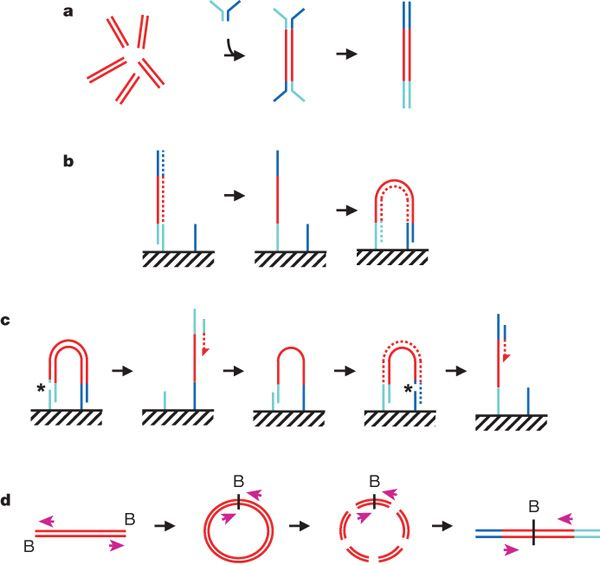
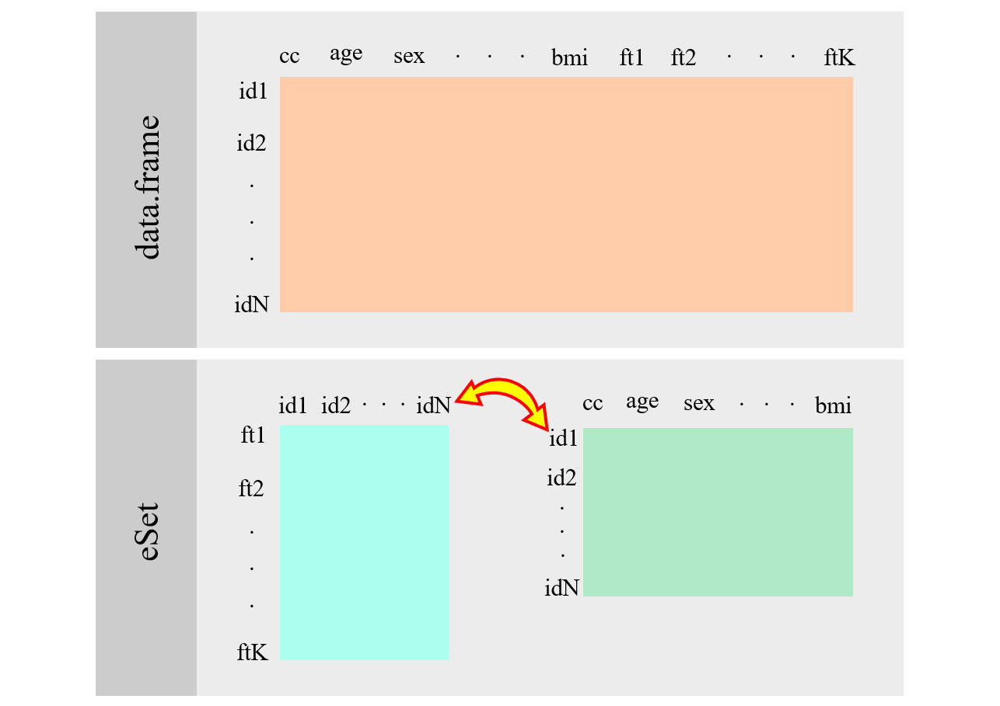
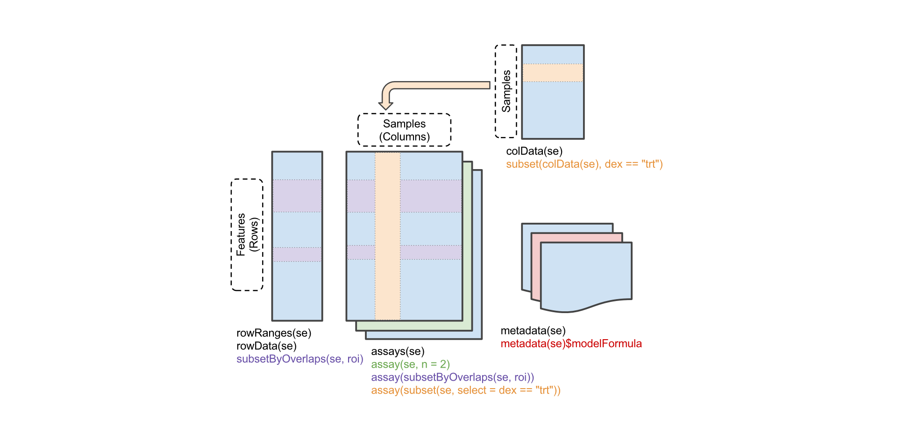
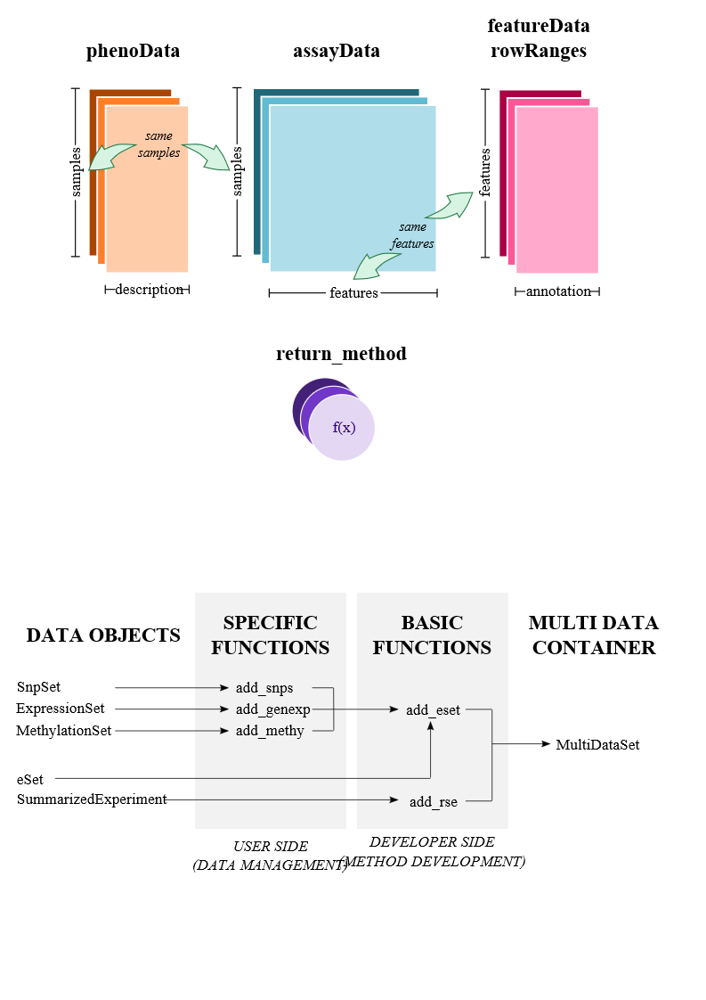

```{r style, echo = FALSE, results = 'asis'}
options(width=100)
knitr::opts_chunk$set(cache=TRUE,
    message = FALSE, comment = "")
```

These are the required libraries to reproduce this document

```{r setup}
library(BiocManager)
library(Biobase)
library(Biostrings)
library(snpStats)
library(GenomicRanges)
library(SummarizedExperiment)
```

# Project Overview

## About

[Bioconductor][]: Analysis and comprehension of high-throughput
genomic data

- Statistical analysis: large data, technological artifacts, designed
  experiments; rigorous
- Comprehension: biological context, visualization, reproducibility
- High-throughput
    - Sequencing: RNASeq, ChIPSeq, variants, copy number, ...
    - Microarrays: expression, SNP, ...
    - Flow cytometry, proteomics, images, ...

Packages, vignettes, work flows

- 1649 software packages (Jan'19); also...
    - 'Annotation' packages -- static data bases of identifier maps,
      gene models, pathways, etc; e.g., [TxDb.Hsapiens.UCSC.hg19.knownGene][]
    - 'Experiment packages -- data sets used to illustrate software
      functionality, e.g., [airway][]
- Discover and navigate via [biocViews][]
- Package 'landing page'
    - Title, author / maintainer, short description, citation,
      installation instructions, ..., download statistics
- All user-visible functions have help pages, most with runnable
  examples
- 'Vignettes' an important feature in Bioconductor -- narrative
  documents illustrating how to use the package, with integrated code
- 'Release' (every six months) and 'devel' branches
- [Support site](https://support.bioconductor.org);
  [videos](https://www.youtube.com/user/bioconductor), [recent
  courses](https://bioconductor.org/help/course-materials/)

Package installation and use

- A package needs to be installed once, using the instructions on the
  package landing page (e.g., [DESeq2][]).

    ```{r install, eval=FALSE}
    source("https://bioconductor.org/biocLite.R")
    biocLite(c("DESeq2", "org.Hs.eg.db"))
    ```
    
-  **NEW** functions have been created
    
    ```{r install_2, eval=FALSE}
    require(BiocManager)
    install("DESeq2")
    
    # or
    
    BiocManager::install("DESeq2")
    ```

older versions can be installed by

    ```{r install_old, eval=FALSE}
    BiocManager::install("DESeq2", version = "3.8")
    ```

- `biocLite()` and `install()` install _Bioconductor_ and [CRAN][] 

- Github packages can be install by

    ```{r install_github, eval=FALSE}
    devtools::install_github("isglobal-brge/SNPassoc")
    ```

- Once installed, the package can be loaded into an R session

    ```{r require}
    library(GenomicRanges)
    ```

    and the help system queried interactively, as outlined above:

    ```{r help-bioc, eval=FALSE}
    help(package="GenomicRanges")
    vignette(package="GenomicRanges")
    vignette(package="GenomicRanges", "GenomicRangesHOWTOs")
    ?GRanges
    ```

## Key concepts

Goals

- Reproducibility
- Interoperability
- Use

What a few lines of _R_ has to say

```{r five-lines}
x <- rnorm(1000)
y <- x + rnorm(1000)
df <- data.frame(X=x, Y=y)
fit <- lm(Y ~ X, df)
anova(fit)
```

Classes and methods -- "S3"

- `data.frame()`
  - Defines _class_ to coordinate data
  - Creates an _instance_ or _object_

- `plot()`, `lm()`, `anova()`, `abline()`: _methods_ defined on
  _generics_ to transform instances

- Discovery and help

    ```{r help-r, eval=FALSE}
    class(fit)
    methods(class=class(fit))
    methods(plot)
    ?"plot"
    ?"plot.formula"
    ```

- tab completion!

_Bioconductor_ classes and methods -- "S4"

- Example: working with DNA sequences

    ```{r classes-and-methods}
    require(Biostrings)
    dna <- DNAStringSet(c("AACAT", "GGCGCCT"))
    reverseComplement(dna)
    ```

- Discovery and help

    ```{r classes-and-methods-discovery, eval=FALSE}
    class(dna)
    ?"DNAStringSet-class"
    ?"reverseComplement,DNAStringSet-method"
    ```

## High-throughput sequence analysis work flows

1. Experimental design

2. Wet-lab sequence preparation (figure from http://rnaseq.uoregon.edu/)


3. (Illumina) Sequencing (Bentley et al., 2008,
   doi:10.1038/nature07517)

    

    - Primary output: FASTQ files of short reads and their [quality
      scores](http://en.wikipedia.org/wiki/FASTQ_format#Encoding)

4. Alignment
    - Choose to match task, e.g., `Rsubread`, Bowtie2 good for ChIPseq,
      some forms of RNAseq; BWA, GMAP better for variant calling
    - Primary output: BAM files of aligned reads
    - More recently: `kallisto` and similar programs that produce
      tables of reads aligned to transcripts
5. Reduction
    - e.g., RNASeq 'count table' (simple spreadsheets), DNASeq called
      variants (VCF files), ChIPSeq peaks (BED, WIG files)
6. Analysis
    - Differential expression, peak identification, ...
7. Comprehension
    - Biological context

## _Bioconductor_ sequencing ecosystem

   

# Annotation

## `annotate` package

Bioconductor distributes annotation packages for a wide range
of gene expression microarrays and RNA-seq data. The annotate
package is one way to use this annotation information. This code loads the `annotate` package and the databases for the Gene Ontology and one of the Affymetrix human microarray chips. 


```{r load_annotate}
require(annotate)
require(hgu95av2.db)
require(GO.db)
```

The databases are queried with `get()` or  `mget()` for multiple
queries:

```{r query}
get("32972_at", envir=hgu95av2GENENAME)
```

```{r mquery}
mget(c("738_at", "40840_at", "32972_at"), 
     envir=hgu95av2GENENAME)
```

The name of the availabe information in a Bioconductor database (ended by `.db`, for instance `org.Hs.eg.db`) can be retreived by using `columns()`:

```{r names_db}
columns(hgu95av2.db)
``` 

The GO terms can be managed by

```{r go}
go <- get("738_at", envir=hgu95av2GO)
names(go)
get("GO:0009117", envir=GOTERM)
```

There are multiple annotated databases in Bioconductor that can be found here: [annotated data bases](http://bioconductor.org/packages/release/data/annotation/). For example

```{r human}
require(org.Hs.eg.db)
columns(org.Hs.eg.db)
# get the gene symbol
get("9726", envir=org.Hs.egSYMBOL)
```


## BioMart

[BioMart](http://www.biomart.org) is a query-oriented data management
system developed jointly by the European Bioinformatics Institute (EBI) and Cold Spring Harbor Laboratory (CSHL). 

`biomaRt` is an R interface to BioMart systems, in particular
to [Ensembl](www.ensembl.org). Ensembl is a joint project between EMBL - European Bioinformatics Institute (EBI) and the Wellcome Trust Sanger Institute (WTSI) to develop a software system which produces and maintains automatic annotation on selected eukaryotic genomes. There are several databases that can be queried:

```{r biomart}
require(biomaRt)
head(listMarts())
```

After selecting a database (e.g., **ensembl**) we select a dataset:

```{r mart2}
mart <- useMart(biomart="ensembl")
listDatasets(mart)[1:10,]
```

After selecting a dataset (e.g., **hsapiens\_gene\_ensembl**) we select the attributes we are interested in:

```{r list_attr}
mart  <- useMart(biomart="ensembl", 
                 dataset="hsapiens_gene_ensembl")
listAttributes(mart)[1:10,]
```

**NOTE**: sometimes the host is not working. If so, try host="www.ensembl.org" in the `useMart` function.

After selecting the dataset we can make different types of queries: 

- **Query 1**: We could look for all the transcripts contained in the gene `7791` (entrez id):

```{r query1}
tx <- getBM(attributes="ensembl_transcript_id",
            filters="entrezgene",
            values="7791", mart=mart)
tx
```

- *Query 2*: We could look for chromosome, position and gene name
of a list of genes (entrez id):

```{r query2}
genes <- c("79699", "7791", "23140", "26009") 
tx <- getBM(attributes=c("chromosome_name", "start_position", 
                         "hgnc_symbol"),
            filters="entrezgene",
            values=genes, mart=mart)
tx
```

- **Query 3**: We could look for chromosome, position and gene name
of a list of genes (ENSEMBL):

```{r query3}
genes <- c("ENSG00000074755") 
tx <- getBM(attributes=c("chromosome_name", "start_position", 
                         "hgnc_symbol"),
            filters="ensembl_gene_id",
            values=genes, mart=mart)
tx
```

- **Query 4**: Homology. `getLDS()` combines two data marts, for example to homologous genes in other species. We can look up the mouse equivalents of a particular Affy transcript, or of the NOX1 gene.

```{r homology} 
human <- useMart("ensembl", dataset = "hsapiens_gene_ensembl")
mouse <- useMart("ensembl", dataset = "mmusculus_gene_ensembl")
getLDS(attributes = c("hgnc_symbol","chromosome_name", 
       "start_position"),
       filters = "hgnc_symbol", values = "NOX1", 
       mart = human,
       attributesL = c("external_gene_name", "chromosome_name",
       "start_position"), 
       martL = mouse)
```

## Annotate SNPs

We had a set of 100 SNPs without chromosome and genomic position information. We need to know the gene that those SNPs belong to. 

```{r snpsList}
load("data/snpsList.Rdata")
length(snpsList)
head(snpsList)
```

- A hand-search (Genome Browser - \url{http://genome.ucsc.edu/}) would be easy but tedious, so we want an automated approach.

- `R` can be used to carry out the entire analysis. That is, GWAS, annotation and post-GWAS. The annotation can be set by connecting `R` with Biomart:

```{r get_mart_snps}
snpmart <- useMart("ENSEMBL_MART_SNP", dataset = "hsapiens_snp")
```

- Use `listAttributes()` to get valid attribute names. 

- Use `listFilters()` to get valid filter names.

```{r get_mart_snps2}
head(listAttributes(snpmart))

head(listFilters(snpmart))
```

We can retrieve chromosome name, genomic position and reference allele in 1000 Genome Project of the 'significant SNPs' (provided in out list) by:

```{r snpsInfo}
snpInfo <- getBM(c("refsnp_id", "chr_name", "chrom_start", 
                   "allele"), filters = c("snp_filter"), 
                 values = snpsList, mart = snpmart)
head(snpInfo)

snpInfo$chr_name <- paste0("chr", snpInfo$chr_name)
```

How do we annotate this SNPs into genes?

- Fist, transform SNP annotation into a `GenomicRange`

```{r get_genes_from_snp}
snpsInfo.gr <- makeGRangesFromDataFrame(snpInfo,
                                        start.field="chrom_start", 
                                        keep.extra.columns = TRUE,
                                        seqnames.field = "chr_name",
                                        end.field = "chrom_start")
snpsInfo.gr
```


# Handling Omic Data

## SNP array data

[snpStats][] (former [snpMatrix][])

SNP array data are normally stored in [PLINK] [] format (or [VCF] [] for NGS data). PLINK data are normally stored in three files .ped, .bim, .fam. The advantage is that SNP data are stored in binary format in the BED file (Homozygous normal 01, Heterozygous 02, Homozygous variant 03, missing 00). 

- FAM  file:  one row per individual - identification information: Family ID, Individual ID
Paternal ID, Maternal ID, Sex (1=male; 2=female; other=unknown), Phenotype.
- BIM file:  one row per SNP (rs id, chromosome, position, allele 1, allele 2).
- BED  file:  one row per individual. Genotypes in columns.

Data are easily loaded into R by using `read.plink` function

```{r, read_plink}
require(snpStats)
snps <- read.plink("data/obesity") # there are three files obesity.fam, obesity.bim, obesity.bed
names(snps)
```

Genotypes is a `snpMatrix` object

```{r, genotypes}
geno <- snps$genotypes
geno
```

Annotation is a `data.frame` object

```{r, annotation}
annotation <- snps$map
head(annotation)
```

## ExpressionSet

[ExpressionSet][]



Description

- `Biobase` is part of the Bioconductor project and contains standardized data structures to represent genomic data. 

- The `ExpressionSet` class is designed to combine several different sources of information into a single convenient structure. 

- An `ExpressionSet` can be manipulated (e.g., subsetted, copied) conveniently, and is the input or output from many Bioconductor functions.

- The data in an `ExpressionSet` consists of expression data from microarray experiments, `meta-data' describing samples in the experiment, annotations and meta-data about the features on the chip and information related to the protocol used for processing each sample 

- Print

```{r, getExpressionSet}
library(tweeDEseqCountData)
data(pickrell)
pickrell.eset
```

- Get experimental data (e.g., gene expression)

```{r, getGeneExpression}
genes <- exprs(pickrell.eset)
genes[1:4,1:4]
```

Get phenotypic data (e.g. covariates, disease status, outcomes, ...)

```{r, getPheno}
pheno <- pData(pickrell.eset)
head(pheno)
pheno$gender
```

This also works

```{r, getPheno2}
pickrell.eset$gender
```

Subsetting (everything is synchronized)

```{r, subset}
eSet.male <- pickrell.eset[, pickrell.eset$gender=="male"]
eSet.male
```

Finally, the `fData` function gets the probes' annotation in a `data.frame`. Let us first illustrate how to provide an annotation to an `ExpressionSet` object

```{r add_annot_eSet}
require(Homo.sapiens)
geneSymbols <- rownames(genes)
annot <- select(Homo.sapiens, geneSymbols, 
                columns=c("TXCHROM", "SYMBOL"), keytype="ENSEMBL")
annotation(pickrell.eset) <- "Homo.sapiens"
fData(pickrell.eset) <- annot
pickrell.eset
```

```{r getProbes} 
probes <- fData(pickrell.eset)
head(probes)
```

## Genomic ranges

[GenomicRanges][]

- `GRanges()`: genomic coordinates to represent annotations (exons,
  genes, regulatory marks, ...) and data (called peaks, variants,
  aligned reads)

- `GRangesList()`: genomic coordinates grouped into list elements
  (e.g., paired-end reads; exons grouped by transcript)


Operations

- intra-range: act on each range independently
    - e.g., `shift()`
- inter-range: act on all ranges in a `GRanges` object or
  `GRangesList` element
      - e.g., `reduce()`; `disjoin()`
- between-range: act on two separate `GRanges` or `GRangesList`
  objects
      - e.g., `findOverlaps()`, `nearest()`
      

Here you can find some examples:      

```{r ranges, message=FALSE}
gr <- GRanges("chr1", IRanges(c(10, 20, 22), width=5), "+")
gr

# shift move all intervals 3 base pair towards the end
shift(gr, 3) 

# inter-range
range(gr)    

            

# two Granges: knowing the intervals that overlap with a targeted region
snps <- GRanges("chr1", IRanges(c(11, 17), width=1))
snps

gr.ov <- findOverlaps(snps, gr)
gr.ov

# recover the overlapping intervals
gr[subjectHits(gr.ov)]

#coverage: summarizes the times each base is covered by an interval
coverage(gr)

# get counts
countOverlaps(gr, snps)
```

This table shows the common operations of `GenomicRanges`

\begin{table}
\footnotesize
  \centering
  \caption{Common operations on \Rclass{IRanges}, \Rclass{GRanges} and
    \Rclass{GRangesList}. Table obtained from \url{https://bioconductor.org/help/course-materials/2014/SeattleFeb2014/}.}
  \label{tab:range-ops}
  \begin{tabular}{lll}
    Category & Function & Description \\
    \hline

    Accessors & \Rfunction{start}, \Rfunction{end}, \Rfunction{width} & 
        Get or set the starts, ends and widths \\
    & \Rfunction{names} & Get or set the names \\
    & \Rfunction{mcols}, \Rfunction{metadata} & 
        Get or set metadata on elements or object \\
    & \Rfunction{length} & Number of ranges in the vector \\
    & \Rfunction{range} & Range formed from min start and max end \\

    Ordering & \Rfunction{<}, \Rfunction{<=}, \Rfunction{>}, \Rfunction{>=}, 
        \Rfunction{==}, \Rfunction{!=} & 
        Compare ranges, ordering by start then width \\
    & \Rfunction{sort}, \Rfunction{order}, \Rfunction{rank} & 
        Sort by the ordering \\
    & \Rfunction{duplicated} & Find ranges with multiple instances \\
    & \Rfunction{unique} & Find unique instances, removing duplicates \\

    Arithmetic & \Robject{r + x}, \Robject{r - x}, \Robject{r * x} & 
        Shrink or expand ranges \Robject{r} by number \Robject{x} \\
    & \Rfunction{shift} & Move the ranges by specified amount \\
    & \Rfunction{resize} & Change width, anchoring on start, end or mid \\
    & \Rfunction{distance} & Separation between ranges (closest endpoints) \\
    & \Rfunction{restrict} & Clamp ranges to within some start and end \\
    & \Rfunction{flank} & Generate adjacent regions on start or end \\

    Set operations & \Rfunction{reduce} & 
        Merge overlapping and adjacent ranges \\
    & \Rfunction{intersect}, \Rfunction{union}, \Rfunction{setdiff} & 
        Set operations on reduced ranges \\
    & \Rfunction{pintersect}, \Rfunction{punion}, \Rfunction{psetdiff} & 
        Parallel set operations, on each \Robject{x[i]}, \Robject{y[i]} \\
    & \Rfunction{gaps}, \Rfunction{pgap} & 
        Find regions not covered by reduced ranges \\
    & \Rfunction{disjoin} & Ranges formed from union of endpoints \\

    Overlaps & \Rfunction{findOverlaps} & 
        Find all overlaps for each \Robject{x} in \Robject{y} \\
    & \Rfunction{countOverlaps} & 
        Count overlaps of each \Robject{x} range in \Robject{y} \\
    & \Rfunction{nearest} & 
        Find nearest neighbors (closest endpoints) \\
    & \Rfunction{precede}, \Rfunction{follow} & 
        Find nearest \Robject{y} that \Robject{x} precedes or follows \\
    & \Robject{x \%in\% y} & 
        Find ranges in \Robject{x} that overlap range in \Robject{y} \\

    Coverage & \Rfunction{coverage} & Count ranges covering each position \\

    Extraction & \Robject{r[i]} & Get or set by logical or numeric index \\
    & \Robject{r[[i]]} & 
        Get integer sequence from \Robject{start[i]} to \Robject{end[i]} \\
    & \Rfunction{subsetByOverlaps} & 
        Subset \Robject{x} for those that overlap in \Robject{y} \\
    & \Rfunction{head}, \Rfunction{tail}, \Rfunction{rev}, \Rfunction{rep} & 
        Conventional R semantics \\

    Split, combine & \Rfunction{split} & 
        Split ranges by a factor into a \Rclass{RangesList} \\
    & \Rfunction{c} & Concatenate two or more range objects \\
    \hline
  \end{tabular}
\end{table}


## Summarized experiments

[SummarizedExperiment][]: 

 

- Comprehensive data structure that can be used to store expression and methylation data from microarrays or read counts from RNA-seq experiments, among others. 

- Can contain slots for one or more _omic_ datasets, feature annotation (e.g. genes, transcripts, SNPs, CpGs), individual phenotypes and experimental details, such as laboratory and experimental protocols. 

- As in an `ExpressionSet` a `SummarizedExperiment`, the rows of _omic_ data are features and columns are subjects. 

- Coordinate feature x sample 'assays' with row (feature) and column
  (sample) descriptions.

- 'assays' (similar to 'exprs' in `ExpressionSet`objects) can be any matrix-like object, including very large on-disk representations such as [HDF5Array][]

- 'assays' are annotated using `GenomicRanges`

- It is being deprecated


## RangedSummarizedExperiments

`SummarizedExperiment` is extended to `RangedSummarizedExperiment`, a child class that contains the annotation data of the features in a `GenomicRanges` object. An example dataset, stored as a `RangedSummarizedExperiment` is available in the `airway` package. This data represents an RNA sequencing experiment.

```{r load_airway}
library(airway)
data(airway)
airway
```

- Some aspects of the object are very similar to `ExpressionSet`, although with slightly different names and types. `colData` contains phenotype (sample) information, like `pData` for `ExpressionSet`. It returns a `DataFrame` instead of a data.frame:

```{r colData}
colData(airway)
``` 

- You can still use `$` to get a particular column:

```{r column}
airway$cell
``` 

- The measurement data are accessed by `assay` and `assays`. A `SummarizedExperiment` can contain multiple measurement matrices (all of the same dimension). You get all of them by assays and you select a particular one by `assay(OBJECT, NAME)` where you can see the names when you print the object or by using `assayNames`. In this case there is a single matrix called counts:

```{r counts}
assayNames(airway)

assays(airway)

head(assay(airway, "counts"))
```

- Annotation is a `GenomicRanges` object

```{r annot_sum_exp}
rowRanges(airway)
```

- Subset for only rows (e.g. features) which are in the interval 1 to 1Mb of chromosome 1

```{r subset_granges}
roi <- GRanges(seqnames="1", ranges=IRanges(start=1, end=1e6))
subsetByOverlaps(airway, roi)
```


## MultiDataSet

[MultiDataSet][]

   

- Designed to encapsulate different types of datasets (including all classes in Bioconductor)
- It properly deals with non-complete cases situations
- Subsetting is easily performed in both: samples and features (using GenomicRanges)
- It allows to:
-- perform integration analysis with third party packages; 
-- create new methods and functions for omic data integration; 
-- encapsule new unimplemented data from any biological experiment

- [MultiAssayExperiment][] is another infrastructure (created by BioC developers)


[Bioconductor]: https://bioconductor.org
[CRAN]: https://cran.r-project.org
[biocViews]: https://bioconductor.org/packages/

[HDF5Array]: https://bioconductor.org/packages/HDF5Array
[AnnotationDbi]: https://bioconductor.org/packages/AnnotationDbi
[AnnotationHub]: https://bioconductor.org/packages/AnnotationHub
[BSgenome.Hsapiens.UCSC.hg19]: https://bioconductor.org/packages/BSgenome.Hsapiens.UCSC.hg19
[BSgenome]: https://bioconductor.org/packages/BSgenome
[BiocParallel]: https://bioconductor.org/packages/BiocParallel
[Biostrings]: https://bioconductor.org/packages/Biostrings
[CNTools]: https://bioconductor.org/packages/CNTools
[ChIPQC]: https://bioconductor.org/packages/ChIPQC
[ChIPseeker]: https://bioconductor.org/packages/ChIPseeker
[DESeq2]: https://bioconductor.org/packages/DESeq2
[DiffBind]: https://bioconductor.org/packages/DiffBind
[GenomicAlignments]: https://bioconductor.org/packages/GenomicAlignments
[GenomicFeatures]: https://bioconductor.org/packages/GenomicFeatures
[GenomicFiles]: https://bioconductor.org/packages/GenomicFiles
[GenomicRanges]: https://bioconductor.org/packages/GenomicRanges
[Gviz]: https://bioconductor.org/packages/Gviz
[Homo.sapiens]: https://bioconductor.org/packages/Homo.sapiens
[IRanges]: https://bioconductor.org/packages/IRanges
[KEGGREST]: https://bioconductor.org/packages/KEGGREST
[OmicCircos]: https://bioconductor.org/packages/OmicCircos
[PSICQUIC]: https://bioconductor.org/packages/PSICQUIC
[Rsamtools]: https://bioconductor.org/packages/Rsamtools
[Rsubread]: https://bioconductor.org/packages/Rsubread
[ShortRead]: https://bioconductor.org/packages/ShortRead
[SomaticSignatures]: https://bioconductor.org/packages/SomaticSignatures
[SummarizedExperiment]: https://bioconductor.org/packages/SummarizedExperiment
[TxDb.Hsapiens.UCSC.hg19.knownGene]: https://bioconductor.org/packages/TxDb.Hsapiens.UCSC.hg19.knownGene
[VariantAnnotation]: https://bioconductor.org/packages/VariantAnnotation
[VariantFiltering]: https://bioconductor.org/packages/VariantFiltering
[VariantTools]: https://bioconductor.org/packages/VariantTools
[airway]: https://bioconductor.org/packages/airway
[biomaRt]: https://bioconductor.org/packages/biomaRt
[cn.mops]: https://bioconductor.org/packages/cn.mops
[csaw]: https://bioconductor.org/packages/csaw
[edgeR]: https://bioconductor.org/packages/edgeR
[ensemblVEP]: https://bioconductor.org/packages/ensemblVEP
[epivizr]: https://bioconductor.org/packages/epivizr
[ggbio]: https://bioconductor.org/packages/ggbio
[h5vc]: https://bioconductor.org/packages/h5vc
[limma]: https://bioconductor.org/packages/limma
[metagenomeSeq]: https://bioconductor.org/packages/metagenomeSeq
[org.Hs.eg.db]: https://bioconductor.org/packages/org.Hs.eg.db
[org.Sc.sgd.db]: https://bioconductor.org/packages/org.Sc.sgd.db
[phyloseq]: https://bioconductor.org/packages/phyloseq
[rtracklayer]: https://bioconductor.org/packages/rtracklayer
[snpStats]: https://bioconductor.org/packages/snpStats

[dplyr]: https://cran.r-project.org/package=dplyr
[data.table]: https://cran.r-project.org/package=data.table
[Rcpp]: https://cran.r-project.org/package=Rcpp
[kallisto]: https://pachterlab.github.io/kallisto

[MultiDataSet]: https://bioconductor.org/packages/MultiDataSet
[snpMatrix]: http://www.bioconductor.org/packages//2.7/bioc/html/snpMatrix.html
[PLINK]: http://pngu.mgh.harvard.edu/~purcell/plink/
[MultiAssayExperiment]: https://bioconductor.org/packages/MultiAssayExperiment