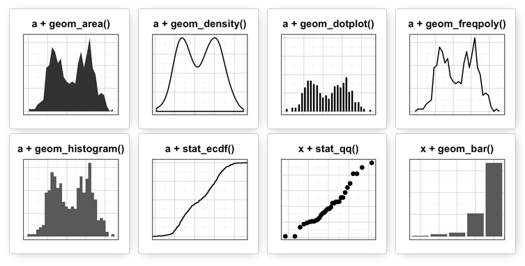

```{r setup, include=FALSE}
knitr::opts_chunk$set(echo = TRUE, comment="", message=FALSE, warning=FALSE, cache=TRUE, fig.width = 3, fig.height = 3)
options(width=80)
```


## ggplot2

Every visualization in ggplot2 is composed of the following:

* Data: the raw material of your visualization
* Layers: what you see on the plot (e.g., points, lines, ...)
* Scales: Maps the data to graphical output
* Coordinates: The visualization's perspective (e.g., grids)
* Faceting: Provides "visual drill-down" into the data
* Themes: Controls the details of the display (e.g. fonts)

**plot = data + Aesthetics + geometry**

----


----

```{r mtcars}
mtcars[1:5,1:8]
```

----

```{r plot_mtcars}
library(ggplot2)
ggplot(mtcars) +         # data
  aes(x = mpg, y=wt) +   # Aesthetics
  geom_point()           # geometry (layer)  
```

----

## Possible aesthetics 

These are some:

* `theme_dark()`
* `theme_minimal()`
* `theme_classic()` 
* `theme_void()` 
* `theme_test()`

----

```{r plot_mtcars2}
ggplot(mtcars) +         # data
  aes(x = mpg, y=wt) +   # Aesthetics
  geom_point() +         # geometry (layer)  
  theme_minimal()        # theme 
```

## Possible geometry (layers)

* For one continuous variable:
    - `geom_area()` for area plot
    - `geom_density()` for density plot
    - `geom_dotplot()` for dot plot
    - `geom_freqpoly()` for frequency polygon
    - `geom_histogram()` for histogram plot
    - `stat_ecdf()` for empirical cumulative density function
    - `stat_qq()` for quantile - quantile plot

* For one discrete variable:
    - `geom_bar()` for bar plot

-----



----

```{r area}
ggplot(mtcars) +        
  aes(sample = mpg) + stat_qq()
```


---- 


## Data distribution (categorical)

```{r data}
library(tidyverse)
diamonds
count(diamonds, cut)
```

```{r empty}
ggplot(data = diamonds)
```

----

```{r dist_cat}
ggplot(data = diamonds) +
  geom_bar(mapping = aes(x = cut))
```

## Data distribution (continous)

```{r dist_cont}
ggplot(data = diamonds) +
  geom_histogram(mapping = aes(x = carat), binwidth = 0.5)
```

## Data distribution (categorical and continous)

```{r dist_2}
ggplot(data = diamonds, mapping = aes(x = price)) + 
  geom_freqpoly(mapping = aes(colour = cut), binwidth = 500)
```

## Data distribution (categorical and continous)


## Boxplot

```{r boxplot}
ggplot(data = mpg, mapping = aes(x = class, y = hwy)) +
  geom_boxplot()
```

## Reordered boxplot (improves interpretation)

```{r boxplot2}
ggplot(data = mpg) +
  geom_boxplot(mapping = aes(x = reorder(class, hwy, 
                             FUN = median), y = hwy))
```

----

```{r boxplot_flipped}
ggplot(data = mpg) +
  geom_boxplot(mapping = aes(x = reorder(class, hwy, 
                                         FUN = median), 
                             y = hwy)) +  coord_flip()
```


## Improved boxplot

```{r improved_boxplot, fig.height=2.5}
ggplot(iris, aes(x=Species, y=Sepal.Width) ) +
  geom_boxplot(alpha=0.3, outlier.colour = "blue") +
  geom_point(stat= "summary", fun.y=mean, 
             shape=16, size=1.5, color="red") +
  geom_jitter(width = 0.1, alpha = 0.2)
```

## Two categorical variables

```{r two_cat, fig.height=3, fig.width=4.5}
ggplot(data = diamonds) +
  geom_count(mapping = aes(x = cut, y = color))
```

----

Another approach is to compute the count with `dplyr`:

```{r get_count}
diamonds %>% 
  count(color, cut)
```

----

and then visuallize with `geom_tile()` and the fill aesthetic:

```{r visualize, fig.height=2, fig.width=4}
diamonds %>% 
  count(color, cut) %>%  
  ggplot(mapping = aes(x = color, y = cut)) +
    geom_tile(mapping = aes(fill = n))
```

## Two continuos variables

```{r 2cont , fig.height=2.5, fig.width=3.5}
ggplot(data = diamonds) +
  geom_point(mapping = aes(x = carat, y = price))
```

----

Scatterplots become less useful as the size of your dataset grows because points begin to overplot: use `alpha` aesthetic:

```{r plot_alpha, fig.height=2.5}
ggplot(data = diamonds) + 
  geom_point(mapping = aes(x = carat, y = price), 
             alpha = 1 / 100)
```

----

Another option is to bin one continuous variable and use `boxplot`

```{r bin_2cont}
ggplot(data = diamonds, mapping = aes(x = carat, y = price)) + 
  geom_boxplot(mapping = aes(group = cut_width(carat, 0.1)))
```

## Fitting regression line

```{r lm_info, eval=FALSE}
library(ggpmisc)
set.seed(1234)
iris <- mutate(iris,
               Y = 1.5 + 3.2*Sepal.Width +
                 rnorm(nrow(iris)))
ggplot(iris, aes(x = Sepal.Width, y = Y)) +
  geom_smooth(method = "lm", se=FALSE, color="black",
              formula = y ~ x) +
  stat_poly_eq(formula = y ~ x,
               aes(label = paste(..eq.label.., ..rr.label.., 
                                 sep = "~~~")),
               parse = TRUE) +
  geom_point()
```

----

```{r lm_info_plot, echo=FALSE}
library(ggpmisc)
set.seed(1234)
iris <- mutate(iris,
               Y = 1.5 + 3.2*Sepal.Width +
                 rnorm(nrow(iris)))
ggplot(iris, aes(x = Sepal.Width, y = Y)) +
  geom_smooth(method = "lm", se=FALSE, color="black",
              formula = y ~ x) +
  stat_poly_eq(formula = y ~ x,
               aes(label = paste(..eq.label.., ..rr.label.., 
                                 sep = "~~~")),
               parse = TRUE) +
  geom_point()
```


## Why using ggplot2?

Let's image we want to compare gene expression by growth rate in twenty genes in six conditions (example obtained from http://varianceexplained.org/r/why-I-use-ggplot2/) 

```{r get_gene_expr}
ff <- "c:/Juan/CREAL/GitHub/TeachingMaterials/Master_Modelling/"
load(file.path(ff, "data/genes.Rdata"))
genes
```

---- 

```{r plot_with_r, eval=FALSE}
par(mar = c(1.5, 1.5, 1.5, 1.5))

colors <- 1:6
names(colors) <- unique(genes$nutrient)

m <- matrix(c(1:20, 21, 21, 21, 21), nrow = 6, 
            ncol = 4, byrow = TRUE)
layout(mat = m, heights = c(.18, .18, .18, .18, .18, .1))

genes$combined <- paste(genes$name, genes$systematic_name)
for (gene in unique(genes$combined)) {
    sub_data <- filter(genes, combined == gene)
    plot(expression ~ rate, sub_data, 
         col = colors[sub_data$nutrient], main = gene)
    for (n in unique(sub_data$nutrient)) {
        m <- lm(expression ~ rate, 
                filter(sub_data, nutrient == n))
        if (!is.na(m$coefficients[2])) {
            abline(m, col = colors[n])
        }
    }
}

# create a new plot for legend
plot(1, type = "n", axes = FALSE, xlab = "", ylab = "")
legend("top", names(colors), col = colors, horiz = TRUE, lwd = 4)
```

----

```{r plot_with_r_show, echo=FALSE, fig.width = 4, fig.height = 4}
par(mar = c(1.5, 1.5, 1.5, 1.5))

colors <- 1:6
names(colors) <- unique(genes$nutrient)

m <- matrix(c(1:20, 21, 21, 21, 21), nrow = 6, 
            ncol = 4, byrow = TRUE)
layout(mat = m, heights = c(.18, .18, .18, .18, .18, .1))

genes$combined <- paste(genes$name, genes$systematic_name)
for (gene in unique(genes$combined)) {
    sub_data <- filter(genes, combined == gene)
    plot(expression ~ rate, sub_data, col = colors[sub_data$nutrient], main = gene)
    for (n in unique(sub_data$nutrient)) {
        m <- lm(expression ~ rate, 
                filter(sub_data, nutrient == n))
        if (!is.na(m$coefficients[2])) {
            abline(m, col = colors[n])
        }
    }
}
# create a new plot for legend
plot(1, type = "n", axes = FALSE, xlab = "", ylab = "")
legend("top", names(colors), col = colors, horiz = TRUE, lwd = 4)
```


----

```{r plot_genes, fig.width=7, fig.height= 4}
ggplot(genes, aes(rate, expression, color = nutrient)) +
    geom_point() +
    geom_smooth(method = "lm", se = FALSE) +
    facet_wrap(~name + systematic_name, scales = "free_y")
```


## Facets

```{r tips}
data(tips, package="reshape2")
head(tips)
```

----

```{r facet}
sp <- ggplot(tips, aes(x=total_bill, y=tip/total_bill)) +
  geom_point()
sp
```

## Facet grid

```{r grid_vertical}
# vertical direction
sp + facet_grid(sex ~ .)
```

----

```{r grid_horiz}
# horizontal direction
sp + facet_grid(. ~ sex)
```

----

```{r grid_two}
# Divide with "sex" vertical, "day" horizontal
sp + facet_grid(sex ~ day)
```

## Facet wrap
Instead of faceting with a variable in the horizontal or vertical direction, facets can be placed next to each other, wrapping with a certain number of columns or rows. The label for each plot will be at the top of the plot.

```{r wrap, fig.height=2}
# Divide by day, going horizontally and wrapping with 2 columns
sp + facet_wrap( ~ day, ncol=2)
```

----

`labeller()` can use any function that takes a character vector as input and returns a character vector as output (e.g. `gsub`). We can also define our own custom functions, like this one, which reverses strings:

```{r reverse_label, eval=FALSE}
# Reverse each strings in a character vector
reverse <- function(strings) {
    strings <- strsplit(strings, "")
    vapply(strings, function(x) {
        paste(rev(x), collapse = "")
    }, FUN.VALUE = character(1))
}

sp + facet_grid(. ~ sex, labeller=labeller(sex = reverse))
```

-----


```{r reverse_label_plot, echo=FALSE}
# Reverse each strings in a character vector
reverse <- function(strings) {
    strings <- strsplit(strings, "")
    vapply(strings, function(x) {
        paste(rev(x), collapse = "")
    }, FUN.VALUE = character(1))
}

sp + facet_grid(. ~ sex, labeller=labeller(sex = reverse))
```

-----

```{r modifying}
sp + facet_grid(sex ~ day) +
    theme(strip.text.x = element_text(size=8, angle=75),
          strip.text.y = element_text(size=12, face="bold"),
          strip.background = element_rect(colour="brown",
                                          fill="tomato"))
```

## More about ggplot2 ....

https://ggplot2.tidyverse.org/reference/


## Exercises (data visualization)

1. Use what you’ve learned to improve the visualisation of the departure times of cancelled vs. non-cancelled flights (NOTE: missing values in the `dep_time` variable indicate that the flight was cancelled).

2. What variable in the diamonds dataset is most important for predicting the price of a diamond? How is that variable correlated with `cut`? Why does the combination of those two relationships lead to lower quality diamonds being more expensive?. NOTE: variable `cut` describes the quality (see `?diamonds`).

3. Visualize the number of flights of each airline by month.

4. Instead of summarising the conditional distribution with a boxplot, you could use a frequency polygon. What do you need to consider when using `cut_width()` vs `cut_number()`? How does that impact a visualisation of the 2d distribution of carat and price (`diamonds` dataset)?
5. Visualise the distribution of carat, partitioned by price on `diamonds` dataset .

-----

6. Download genome data (https://github.com/isglobal-brge/TeachingMaterials/blob/master/Master_Modelling/data/genome.txt) into your computer and load it into RStudio by using `read_delim` function (NOTE: data are tab-delimited). 

The file is containing information about

* Name: genomic variant (single nucleotide polymorphism)
* Chr: chromosome 
* Position: chromosome position
* Log.R.Ratio: log-ratio intensity of the two alleles
* B.Allele.Freq: frequency of the alternative allele


----

Do the following tasks:

**6.1:** Which is the expected value of `Log.R.Ratio` and `B.Allel.Freq` for each chromosome? (show the R code to get your answer)

**6.2:** Create a facet plot that represent the `Log.R.Ratio` for each chromosome

**6.3:** Create a facet plot of `B.Allele.Freq` for chromosomes 1, 2, 3, ..., 6 drawing `B.Allele.Freq` information in red color.


## Session info

```{r}
sessionInfo()
```
