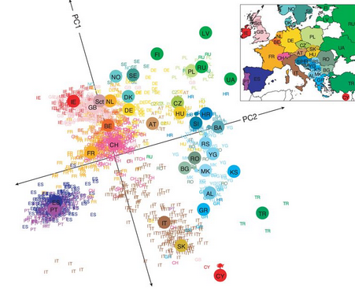

```{r setup, include=FALSE}
knitr::opts_chunk$set(echo = TRUE, comment="", message=FALSE, warning=FALSE, cache=TRUE, fig.width = 4, fig.height = 4)
options(width=80)
```

## Credits

[R for Data Science:](http://r4ds.had.co.nz/index.html) http://r4ds.had.co.nz/index.html


## Outline of the course

* Day 1: Introduction (1h)
     - PCA for big data
     
* Day 1: Reproducible Research (1h)
     - knitr
     - R markdown 

* Day 2: Tidyverse - Data wrangling (1h)
     - Data wrangling 
     - Tibbles
     - Data import
     - Relational data
     - Strings, Factors (not covered)

-----
   
* Day 2: Tidyverse - Data transformation (1h)   
     - Filter rows
     - Arrange rows
     - Select columns
     - Add columns
     - Grouped summaries
     - Grouped mutates

* Day 3: Tidyverse - Data visualization (1h)
     - Exploratory data analysis 
     - Advanced graphics
     - Learning more

* Day 3: Visualization Large Datasets (1h)
     - Genomics: GViz
     - bigvis


## Principal component analysis (PCA) in data science

* PCA is one of the most commonly used method to visualize large data sets.
* It aims to reduce the dimensionallity into a couple of principal axes that capture most of the observed data variability.
* PVA is related to the Single Valude Decomposition (SVD) problem. 

## Example: Genomics




## Example: Twin heights

We started the motivation for dimension reduction with a simulated example and showed a rotation that is very much related to PCA.


```{r simulate_twin_heights_again, echo=FALSE, message=FALSE, fig.cap="Twin heights scatter plot."}
library(MASS)
n <- 100
set.seed(1)

Y <- mvrnorm(n, c(0,0), matrix(c(1,0.95,0.95,1),2,2))

plot(Y[,1], Y[,2], xlab="Twin 1 (standardized height)",
     ylab="Twin 2 (standardized height)", 
     xlim=c(-3,3), ylim=c(-3,3))
points(Y[1:2, 1], Y[1:2, 2], col=2, pch=16)
```

----- 

Here we explain specifically what are the principal components (PCs).

Let $\mathbf{Y}$ be $N \times 2$ matrix representing our data ($N$ individuals $2$ variables). Suppose we are given the task of finding a  $1 \times 2$ vector $\mathbf{v}_1$ such that $\mathbf{v}_1^\top \mathbf{v}_1 = 1$
and it maximizes $(\mathbf{Y}\mathbf{v}_1^\top)^\top (\mathbf{Y}\mathbf{v}_1^\top)$. This can be viewed as a projection of each sample or column of $\mathbf{Y}$ into the subspace spanned by $\mathbf{v}_1$. So we are looking for a transformation in which the coordinates show high variability.

-----

Let's try $\mathbf{v}=(1,0)$. This projection simply gives us the height of twin 1 shown in orange below. The sum of squares is shown in the title.

```{r projection_not_PC1, fig.align="Data projected onto space spanned by (1 0).", echo=FALSE, message=FALSE, results='hide'}

plot(Y, xlim=c(-3,3), ylim=c(-3,3),
     main=paste("Sum of squares :", round(crossprod(Y[,1]),1)))
abline(h=0)
apply(Y, 1, function(y) segments(y[1],0,y[1],y[2],lty=2))
points(Y[,1],rep(0,nrow(Y)), col=2, pch=16, cex=0.75)
```

-----


Can we find a direction with higher variability? How about:

$\mathbf{v} = (1, -1)$ ? This does not satisfy $\mathbf{v}^\top\mathbf{v}= 1$ so let's instead try
$\mathbf{v} = (1/\sqrt{2}, -1/\sqrt{2})$ 

```{r projection_not_PC1_either, fig.cap="Data projected onto space spanned by (1 0).", echo=FALSE}
v <- matrix(c(1,-1)/sqrt(2), nrow = 1)
w <- Y%*%t(v)

plot(Y, main=paste("Sum of squares:", round(crossprod(w),1)),
     xlim=c(-3,3), ylim=c(-3,3))
abline(h=0,lty=2)
abline(v=0,lty=2)
abline(0,-1,col=2)
Z <- w%*%v
for(i in seq(along=w))
  segments(Z[i, 1], Z[i, 2], Y[i, 1],Y[i, 2], lty=2)
points(Z, col=2, pch=16, cex=0.5)
```


-----

This relates to the difference between twins, which we know is small. The sum of squares confirms this.

Finally, let's try:

$\mathbf{v} = (1/\sqrt{2}, 1/\sqrt{2})$ 


```{r PC1, fig.cap="Data projected onto space spanned by first PC.", echo=FALSE}
v <- matrix(c(1,1)/sqrt(2), nrow=1)
w <- Y%*%t(v)

plot(Y, main=paste("Sum of squares:",round(crossprod(w),1)),
     xlim=c(-3,3), ylim=c(-3,3))
abline(h=0,lty=2)
abline(v=0,lty=2)
abline(0,1,col=2)
points(w%*%v, col=2, pch=16, cex=1)
Z <- w%*%v
for(i in seq(along=w))
  segments(Z[i,1], Z[i,2], Y[i,1], Y[i,2], lty=2)
points(t(Z), col=2, pch=16, cex=0.5)
```

-----

This is a re-scaled average height, which has higher sum of squares. There is a mathematical procedure for determining which $\mathbf{v}$ maximizes the sum of squares and the SVD provides it for us.

```{r get PCA}
ss <- svd(Y)
v <- ss$v[,1]
v
1/sqrt(2)
```
The sum of squares is:

```{r SS}
w <- Y%*%v
crossprod(w) # t(w)%*%w
``` 


## The principal components

The orthogonal vector that maximizes the sum of squares:

$$(\mathbf{Y}\mathbf{v}_1^\top)^\top(\mathbf{Y}\mathbf{v}_1^\top)$$ 

$\mathbf{Y}\mathbf{v}_1^\top$ is referred to as the first PC. The _weights_ $\mathbf{v}$ used to obtain this PC are referred to as the _loadings_. Using  the language of rotations, it is also referred to as the _direction_ of the first PC, which are the new coordinates.

To obtain the second PC, we repeat the exercise above, but for the residuals:

$$\mathbf{r} = \mathbf{Y} -  \mathbf{v_1Y}\mathbf{v}_1^\top $$
-------

The second PC is the vector with the following properties: 

$$\mathbf{v}_2 \mathbf{v}_2^\top=1$$

$$ \mathbf{v}_1 \mathbf{v}_2^\top =0$$ 

and maximizes  $\mathbf{rv}_2 (\mathbf{rv}_2)^\top$.

When $Y$ is $N \times m$ we repeat to find 3rd, 4th, ..., m-th PCs.

## `prcomp`

We have shown how to obtain PCs using the SVD. However, R has a function specifically designed to find the principal components. In this case, the data is centered by default. The following function: 

```{r}
pc <- prcomp(Y, center = FALSE)
```

produces the same results as the SVD up to arbitrary sign flips:

```{r pca_svd, fig.cap="Plot showing SVD and prcomp give same results.",fig.width=10.5,fig.height=5.25}
s <- svd( t(Y) )

# First axis
max(abs(pc$x[,1]) - abs(s$d[1]*s$v[,1]))

# Second axis
max(abs(pc$x[,2]) - abs(s$d[2]*s$v[,2]))
```

-----

The loadings can be found this way:
```{r}
pc$rotation
```
which are equivalent (up to a sign flip) to:
```{r}
s$u
```

------

The equivalent of the variance explained is included in: 
```{r variance_explained}
pc$sdev
s$d
```

```{r cum_variance_explained}
cumsum(pc$sdev)/sum(pc$sdev)
```

## Example: data imaging

```{r pansy}
library(imager)
x <- load.image("figures/pansy.jpg")
plot(x)
```


-----
```{r grayscale}
m <- grayscale(x)
plot(m)
```

## Retrieving image

```{r svd_pansy}
r.svd <- svd(m)
d <- diag(r.svd$d)
u <- r.svd$u
v <- r.svd$v

# first approximation
u1 <- as.matrix(u[-1, 1])
v1 <- as.matrix(v[-1, 1])
d1 <- as.matrix(d[1,1])
l1 <- u1 %*% d1 %*% t(v1)
l1g <- as.cimg(l1)
```
-----

```{r plot_first_approximation}
plot(l1g)
```

-----

```{r more_depth}
# more depth
depth <- 8
us <- as.matrix(u[, 1:depth])
vs <- as.matrix(v[, 1:depth])
ds <- as.matrix(d[1:depth, 1:depth])
ls <- us %*% ds %*% t(vs)
lsg <- as.cimg(ls)
plot(lsg)
```

## Large datasets (2-10 GB)

* PCA based on SVD scales as $O(\min(N^2p, Np^2))$ 
* This makes it time-consuming to perform PCA in large datasets
* There are some solutions:
     - Randomized matrix algorithms\footnote{Halko N, Martinsson PG, Shkolnisky Y, Tygert M (2011) An Algorithm for the Principal Component Analysis of Large Data Sets. SIAM Journal on Scientific Computing 33: 2580–2594.}, \footnote{Halko N, Martinsson PG, Tropp JA (2011) Finding Structure with Randomness: Probabilistic Algorithms for Matrix Decompositions. SIAM Review 53: 217–288.}
     - Partial or truncated SVD\footnote{Baglama, James, and Lothar Reichel. Augmented implicitly restarted Lanczos bidiagonalization methods. SIAM Journal on Scientific Computing 27.1 (2005): 19-42.} 

## Exercise
* Find an R package that performs truncated SVD.
* Create a function (or write and R script) that performs PCA based on truncated SVD.
* Perform PCA analysis using this new R code and compare the results obtained using `prcomp` function on the data set `musk.txt` described [here](https://archive.ics.uci.edu/ml/datasets/Musk+(Version+2))\footnote{NOTE1: do not foget to remove last column; NOTE2: use `microbenchmark` function to compare computation speed}.
* Plot the molecules (e.g. observations/rows) in the first two axes and color each dot using the information given in the column `musk`.

-----

`musk` dataset describes a set of 102 molecules (repeated measures, in total there are 476 observations) of which 39 are judged by human experts to be musks and the remaining 63 molecules are judged to be non-musks. The goal is to learn to predict whether new molecules will be musks or non-musks. In this task we only aim to see whether the two first principal components discriminate musks and non-musks molecules. Data columns represent:

* f_1 ... f_162: distance features measured in hundredths of Angstroms. 
* f163: distance of the oxygen atom in the molecule to a designated point in 3-space. This is also called OXY-DIS.
* f164: OXY-X: X-displacement from the designated point.
* f165: OXY-Y: Y-displacement from the designated point.
* f166: OXY-Z: Z-displacement from the designated point.
* musk: 0:non-musk, 1:musk


## Session info

```{r}
sessionInfo()
```

