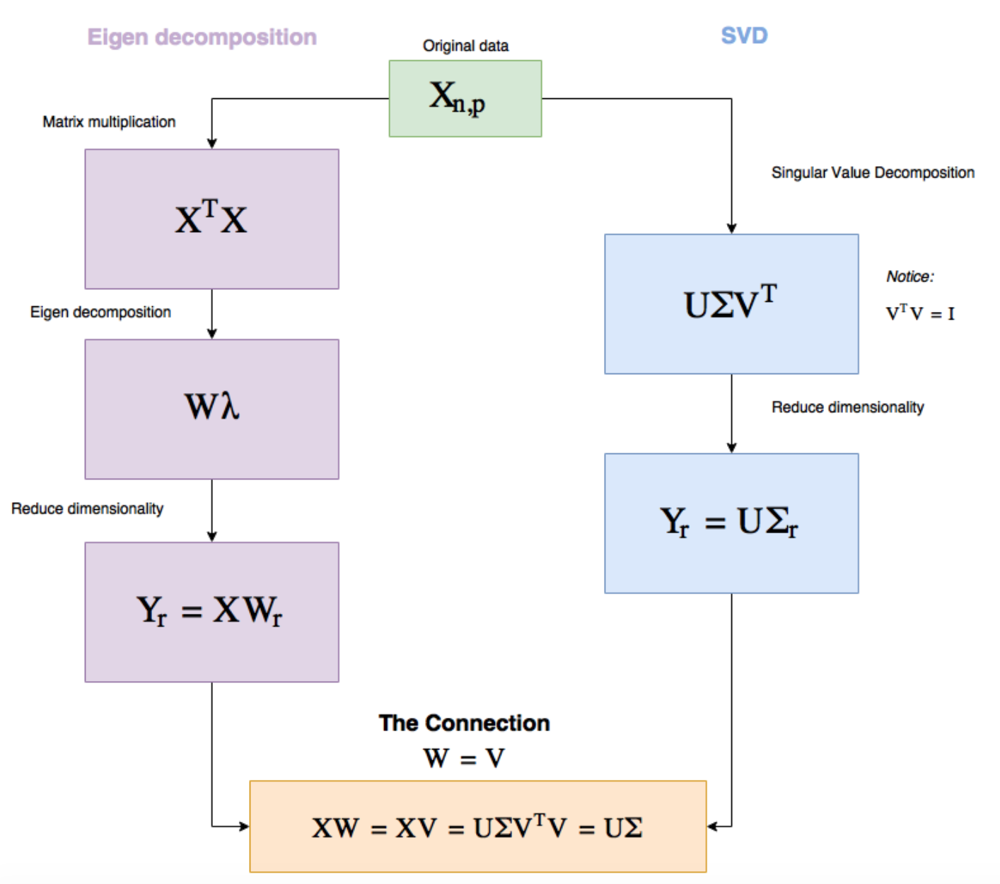

```{r setup, include=FALSE}
knitr::opts_chunk$set(echo = TRUE, comment="", message=FALSE, warning=FALSE, cache=TRUE, fig.width = 4, fig.height = 4)
options(width=80)
```


## PCA vs SVD




## Example

`musk` dataset describes a set of 102 molecules (repeated measures, in total there are 476 observations) of which 39 are judged by human experts to be musks and the remaining 63 molecules are judged to be non-musks. The goal is to learn to predict whether new molecules will be musks or non-musks. In this task we only aim to see whether the two first principal components discriminate musks and non-musks molecules. Data columns represent:

* f_1 ... f_162: distance features measured in hundredths of Angstroms. 
* f163: distance of the oxygen atom in the molecule to a designated point in 3-space. This is also called OXY-DIS.
* f164: OXY-X: X-displacement from the designated point.
* f165: OXY-Y: Y-displacement from the designated point.
* f166: OXY-Z: Z-displacement from the designated point.
* musk: 0:non-musk, 1:musk


## Example

Analysis with R

```{r data}
dd <- read.delim("c:/Juan/CREAL/GitHub/TeachingMaterials/Master_Modelling/data/musk.txt")
names(dd)
```

-------

```{r pca}
library(factoextra)
o <- which(colnames(dd)=="musk")
group <- factor(dd[,o], labels = c("non-musk", "musk"))
pp <- prcomp(dd[ , -o])
fviz_pca_ind(pp, habillage=group)
```

## Truncated PCA and SVD (irlba)

It is a fast and memory-efficient way to compute a partial SVD, principal components, and some specialized partial eigenvalue decompositions (J. Baglama and L. Reichel. SIAM J. Sci. Comput. ,2005) implemented in an R package:

- `irlba()` partial SVD function
- `ssvd()` l1-penalized matrix decompoisition for sparse PCA (based on Shen and Huang’s algorithm)–see https://bwlewis.github.io/irlba/ssvd.html for more details
- `prcomp_irlba()` PCA function similar to the `prcomp` function in stats package for computing the first few principal components of large matrices
- `svdr()` randomized SVD (alternative to truncation)
-  `partial_eigen()` a very limited partial eigenvalue decomposition for symmetric matrices (see the **RSpectra** R package for more comprehensive truncated eigenvalue decomposition); see also https://bwlewis.github.io/irlba/comparison.html for more notes on RSpectra.


-----

```{r irlba}
library(irlba)
pp2 <- prcomp_irlba(dd[ , -o], n = 2)
ind.coord <- pp2$x
mycol <- ifelse(group=="musk", "darkgreen", "blue")
plot(ind.coord[,1], ind.coord[,2], pch = 19, col=mycol, 
     xlab="PC1", ylab="PC2")
abline(h=0, v=0, lty = 2)
```


------

```{r comparison}
library(microbenchmark)
microbenchmark(irlba = prcomp_irlba(dd[ , -o], n = 2),
               prcomp = prcomp(dd[ , -o]))
```


## Other resources

- C++ Library For Large Scale Eigenvalue Problems (Spectra): https://spectralib.org/index.html
- RSpectra: https://cran.r-project.org/web/packages/RSpectra/vignettes/introduction.html
- Benchmarck: https://spectralib.org/performance.html
- irlba vs RSpectra: https://bwlewis.github.io/irlba/comparison.html (a non-biased comparison: https://rpubs.com/koheiw/330986)


## Session info

```{r}
sessionInfo()
```

