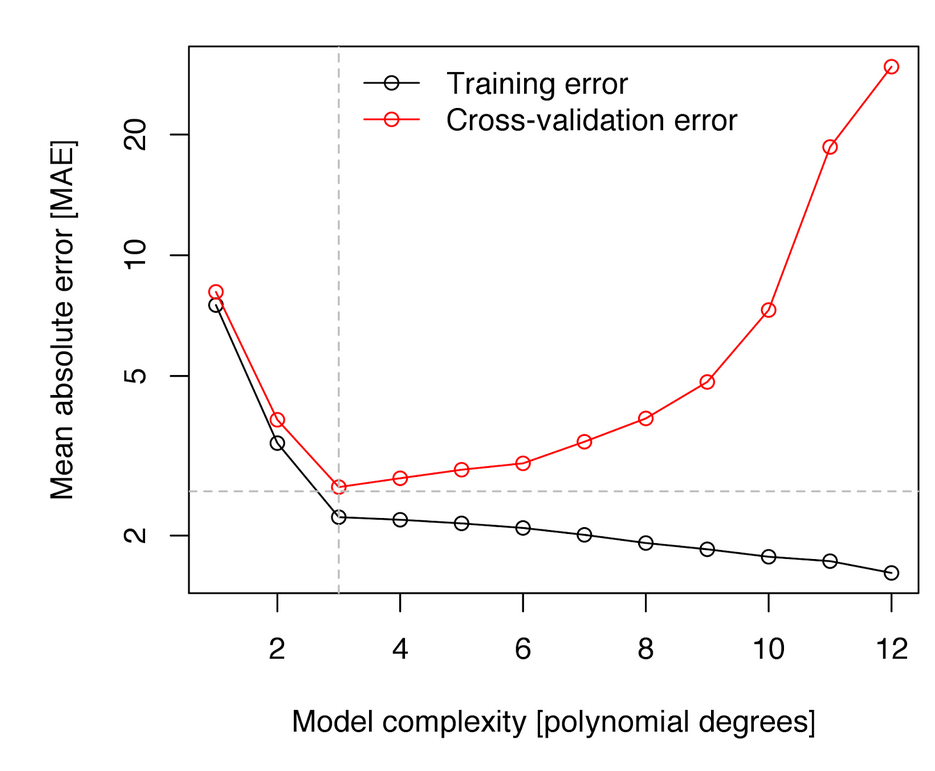
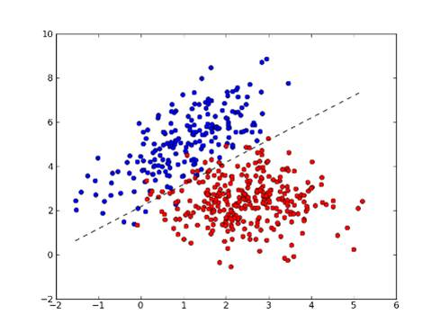
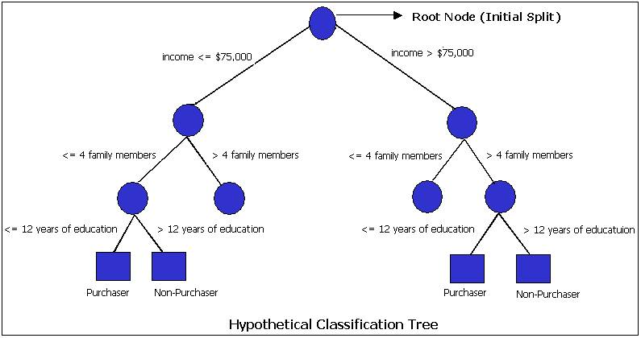
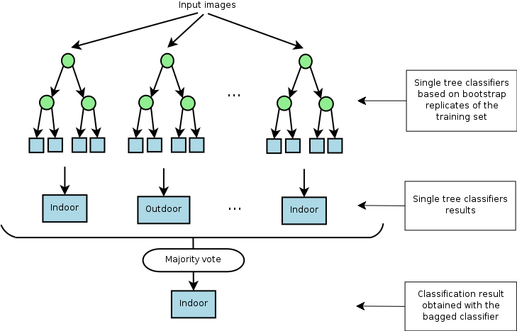

```{r style, echo=FALSE, warning=FALSE}
library("knitr")
opts_chunk$set(message = FALSE, error = TRUE, 
               warning = FALSE, cache=TRUE, comment = "")
```


# Introducción

Los algoritmos de machine learning permiten crear un modelo capaz de representar los patrones presentes en los datos de entrenamiento y generalizarlos a nuevas observaciones (predicción). Encontrar el mejor modelo no es fácil, existen multitud de algoritmos, cada uno con unas características propias y con distintos parámetros que deben ser ajustados. Por lo general, las etapas seguidas para obtener un buen modelo son:

- **Ajuste/entrenamiento**: consiste en aplicar un algoritmo de machine learning a los datos de entrenamiento para que el modelo aprenda.

- **Evaluación/validación**: el objetivo de un modelo predictivo no es ser capaz de predecir observaciones que ya se conocen, sino nuevas observaciones que el modelo no ha visto. Para poder estimar el error que comete un modelo es necesario recurrir a estrategias de validación. Para ello se puede usar una base de datos externa (test), y en caso de no disponer de esa información, se pueden usar técnicas de remuestreo como bootstrap o validación cruzada. 

- **Optimización de hiperparámetros**: muchos algoritmos de machine learning dependen de parámetros que no se pueden estimar con los datos (hiperparámetros). Por ejemplo, la regresión lasso depende de un parámetro `lambda` que controla el número de variables cuyo efecto es cero. No existe forma de conocer de antemano cuál es el valor exacto de un hiperparámetro que da lugar al mejor modelo, por lo que se tiene que recurrir a estrategias de validación para comparar distintos valores. A estos valores también se conocen como `tuning parameters`.

- **Predicción**: una vez creado el modelo, este se emplea para predecir nuevas observaciones.


# Cross-validación

Supongamos que tenemos un algoritmo de predicción para clasificar individuos/observaciones utilizando una serie de características. Un ejemplo donde se utilizan estos métodos de predicción es en la concesión de créditos hipotecários. Supongamos que tenemos una base de datos donde se ha recogido si el cliente es bueno o malo (variable `Status`) y una serie de variables que queremos usar para predecir cuál será el comportamiento de un nuevo cliente. 

```{r credit}
library(tidyverse)
library(prettyR)
credit <- read_csv("data/CleanCreditScoring.csv")
describe(credit)
```


Una vez que creemos un model, necesitaremos determinar su precisión en cuanto a las predicciones relizadas en observaciones que no han sido usadas para crear el modelo. En otras palabras, estamos interesados en estimar el error de predicción. Para hacer este cálculo necesitamos:

- Crear un modelo con los datos de entrenamiento
- Aplicar el modelo a un nuevo set de datos para obtener las preducciones
- Calcular el error de predicción

Existen numerosas métricas estadísticas para cuantificar la calidad global de los modelos de regresión. Entre otras:

- *R-cuadrado (R2)* que representa el cuadrado de la correlación entre la variable resultado y las variables predictoras. Cuanto más alto R2 (ajustado), mejor modelo tenemos. 
- *Root Mean Squared Error (RMSE)* que mide el error de predicción promedio para una observación. Es decir, es la diferencia entre el valor observado y el valor predicho por el modelo. Cuanto más bajo es el RMSE, mejor es el modelo.
- *Mean Absolute Error (MAE)*, es una alternativa al RMSE que es menos sensible a los outliers. Corresponde al promedio de la diferencia en valor absoluto entre el valor observado y el valor predicho por el modelo. Cuanto más pequeño es el MAE, mejor el el modelo. 

Para la predicción de variables categóricas, las medidas de calidad del modelo son:


De manera breve, los algorithmos de cross-validation se pueden resumir como:

- Reserva una parte pequeña de los datos
- Crea (o entrena) el modelo usando el resto de datos
- Testa el modelo en los datos reservados. 

A continuación se describen algunas de las distintas técnicas de validación cruzada que existen.

## Validación en un conjunto de datos externo

```{r cv_conjunto}
# Partimos los datos: 80% training, 20% test
set.seed(123)
training.samples <- credit$Status %>%
  createDataPartition(p = 0.8, list = FALSE)
train.data  <- credit[training.samples, ]
test.data <- credit[-training.samples, ]

# Creamos el modelo (linear discriminat analysis - LDA)
model <- lda(Status ~., data = train.data)

# Calulamos predicciones y las medidas de 
predictions <- model %>% predict(test.data) 
confusionMatrix(data = as.factor(predictions$class), 
                reference = as.factor(test.data$Status))
```

## Leave one out cross validation - LOOCV

Este método funciona de la siguiente manera:

This method works as follow:

- Extrae una observación de los datos y usa el resto para entrenar el modelo
- Testa el modelo con la observación que ha sido extraída en el paso anterior y guarda el error asociado a esa predicción
- Repite el proceso para todos los puntos
- Calcula el error de predicción global usando el promedio de todos los errores estimados en el paso 2. 

```{r loocv, eval=FALSE}
# Definimos el methodo para el entrenamiento
train.control <- trainControl(method = "LOOCV")
# Entrenamos el modelo
model <- train(Status ~., data = credit, method = "lda",
               trControl = train.control)
# Visualizamos los resultados
model
```
## K-fold cross-validation

La diferencia con LOOCV es que este método evalúa el comportamiento del modelo en un conjunto de datos de distingo tamaño (K). El algoritmo es el siguiente:

- Separa los datos en k-subconjuntos (k fold) de forma aleatoria
- Guarda uno de los subconjuntos de datos y entrena el modelo con el resto de individuos
- Testa el modelo con los datos resevados y guarda el error de predicción promedio. 
- Repite el proceso hasta que los k subconjuntos hayan servido de muestra test.
- Calcula el promedio de los k errores que han sido guardados. Este valor es el error de cross-validación y nos sirve para evaluar el comportamiento de nuestro modelo como si lo usáramos en una base de datos externa. 

La principal ventaja de este método respecto a LOOCV es el coste computacional. Otra ventaja que no es tan obvia, es que este método a menudo da mejores estimaciones del error del modelo que LOOCV (James et al. 2014).

Una pregunta típica es cómo se escoje el valor óptimo de K. Valores pequeños de K da estimaciones sesgadas. Por otro lado, valores grandes de K están menos sesgados, pero tienen mucha variabilidad. En la práctica, normalmente se usan valores de k = 5 or k = 10, ya que estos valores se han mostrado de forma empírica como los que tienen tasas de error estimadas no demasiado sesgadas ni con mucha varianza. 

```{r k_fold}
# Definimos el methodo para el entrenamiento
train.control <- trainControl(method = "cv", number = 10)
# Entrenamos el modelo
model <- train(Status ~., data = credit, method = "lda",
               trControl = train.control)
# Visualizamos los resultados
model
```

Veremos más adelante que estos métodos son fácilmente paralelizables ya que cada evaluación es independiente del resto.


# Uso para estimar el mejor hiperparámetro

Si el algoritmo de machine learning que vamos a utilizar para realizar predicciones tiene un parámetro que controla el comportamiento (por ejemplo grado de polinomio en regresión no lineal, o el número de nodos en árboles de clasificación, o el parámetro de penalización en regresión lasso) éste podría elegirse de forma que minimizara el error de clasificación. Realizar este proceso con los datos que vamos a usar para  *entrenar* el modelo pueden llevar a un problema que se conoce como *overfitting*.

Para evitar el problema, se puede utilizar una muestra test para evaluar nuestro modelo para cada valor del hiperparámetro. Dado que a veces el número de individuos es limitado, también se puede utilizar técnicas de validación cruzada para este menester. Como ya hemos visto anteriormente, la validación cruzada es simplemente un método que divide los datos en un
número fijado de conjutos de datos (*fold*). Si tenemos K-folds entonces el algoritmo típicamente entrena en (K-1) de los subconjuntos de datos, y se prueba el rendimiento de los algoritmos en el que queda fuera. Este proceso se repite K veces hasta que cada subconjunto de datos se ha utilizado como un *test* set.




# Entrenamiento del modelo

Existen numerosas librerías en R para crear modelos de predicción como regresión logística, boosting, random forest, redes neuronales, ...  Sin embargo, lo más recomendable es usar la librería `caret` que permite emplear la misma sintaxis para ajustar, optimizar, evaluar y predecir un amplio abanico de modelos variando únicamente el nombre del algoritmo. Aunque `caret` permite todo esto con apenas unas pocas líneas de código, son muchos los argumentos que pueden ser modificados. A continuación describimos los más relevantes.

Todos los modelos incorporados en el paquete caret se entrenan con la función `train()`. Entre los argumentos de esta función destacan:

- `formula`: la fórmula del modelo que se quiere crear.
-  `x`, `y`: en lugar de una fórmula, se pueden pasar por separado los valores de los predictores y de la variable respuesta.
- `method`: el nombre del algoritmo que se desea emplear (http://topepo.github.io/caret/train-models-by-tag.html).
- `metric`: las métricas empleadas para evaluar la capacidad predictiva del modelo. Por defecto, se emplea accuracy para problemas de clasificación y RMSE para regresión.
- `trControl`: especificaciones adicionales sobre la forma de llevar a cabo el entrenamiento del modelo.
- `...`: argumentos propios del algoritmo empleado. 


Ilustremos cómo llevar a cabo el entrenamiento de un modelo predictivo con algunas de las téncnicas de machine learning más usuales. Para ello, utilizaremos los datos usados para crear un modelo predictivo en cáncer de mama facilitados en _Kaggle_ (competición) [https://www.kaggle.com/uciml/breast-cancer-wisconsin-data]. La idea es crear un modelo que prediga si el tumor es benigno o no (variable `diagnosis`).

```{r load_breast}
library(tidyverse)
datos <- read_csv("data/breast.csv")
datos
``` 

Como no tenemos otro dataset para usar como test, creamos uno artificial. Notamos que la primera variable es la variable identificadora y la variable `symmetry_worst` es constante en todos los individuos, por lo que hay que eliminarlas del análisis

```{r split}
library(caret)
set.seed(123)
train <- createDataPartition(y = datos$diagnosis, p = 0.8, 
                             list = FALSE, times = 1)
datos_train <- datos[train, -c(1, 31)] 
datos_test  <- datos[-train, -c(1, 31)]
```

Es importante verificar que la distribución de la variable respuesta es similar en el conjunto de entrenamiento y en el de test. Por defecto, la función `createDataPartition()` garantiza una distribución aproximada.

```{r check}
prop.table(table(datos_train$diagnosis))
prop.table(table(datos_test$diagnosis))
```

## Análisis discriminante lineal



El análisis discriminante lineal está implementado en la función `lda` de R. No necesita ninguna librería ni hiperparámetros

```{r lda}
library(caret)
mod.lda <- train(diagnosis ~ ., method = "lda", 
                 data = datos_train)
mod.lda
```


## Árboles de clasificación



Ahora usaremos un árbol de clasificación como método de machine learning. El método `C5.0Tree` de `caret` emplea la función `C5.0.default()` del paquete `C50` para crear un árbol de clasificación simple. Este algoritmo no tiene ningún hiperparámetro. 

Aprovecharemos este ejemplo para ilustrar ahora cómo realizar los análisis de forma genérica, es decir, incluyendo cómo estimar los hiperparámetros y ajustar el modelo mediante validación cruzada.

```{r tree}
# PARALELIZACIÓN DE PROCESO
#==============================================================
library(doParallel)
cl <- makePSOCKcluster(3)
registerDoParallel(cl)


# HIPERPARÁMETROS, NÚMERO DE REPETICIONES Y SEMILLAS 
#==============================================================
particiones  <- 10
repeticiones <- 5

# Hiperparámetros
hiperparametros <- data.frame(parameter = "none")

set.seed(12345)
seeds <- vector(mode = "list", length = (particiones *
                                           repeticiones) + 1)
for (i in 1:(particiones * repeticiones)) {
  seeds[[i]] <- sample.int(1000, nrow(hiperparametros))
}
seeds[[(particiones * repeticiones) + 1]] <- 
  sample.int(1000, 1)

# DEFINICIÓN DEL ENTRENAMIENTO
#==============================================================
control_train <- trainControl(method = "repeatedcv", 
                              number = particiones,
                              repeats = repeticiones, 
                              seeds = seeds,
                              returnResamp = "final",
                              verboseIter = FALSE,
                              allowParallel = TRUE)

# AJUSTE DEL MODELO
# =============================================================
set.seed(12345)
mod.C50Tree <- train(diagnosis ~ ., 
                        data = datos_test,
                        method = "C5.0Tree",
                        tuneGrid = hiperparametros,
                        metric = "Accuracy",
                        trControl = control_train)
mod.C50Tree
```

También podemos evaluar el comportamiento en un test set

```{r test_tree}
pred.c50Tree <- mod.C50Tree %>% 
                   predict(datos_test) %>% as.vector()

# Model performance metrics

confusionMatrix(data = as.factor(pred.c50Tree), 
                reference = as.factor(datos_test$diagnosis))

confusionMatrix(data = as.factor(pred.c50Tree), 
                reference = as.factor(datos_test$diagnosis), 
                mode = "prec_recall")
```


## Random Forest




La librería `caret` usa puede usar la función `rf` del paquete `randomForest`. Esta función sólo necesita optimizar el hiperparámetro `mtry` que determina el número de predictores seleccionados aleatoriamente en cada árbol.


```{r rf}
# PARALELIZACIÓN DE PROCESO
#==============================================================
library(doParallel)
cl <- makePSOCKcluster(3)
registerDoParallel(cl)


# HIPERPARÁMETROS, NÚMERO DE REPETICIONES Y SEMILLAS 
#==============================================================
particiones  <- 10
repeticiones <- 5

# Hiperparámetros
hiperparametros <- expand.grid(mtry = c(3, 4, 5, 7))
hiperparametros

set.seed(12345)
seeds <- vector(mode = "list", length = (particiones *
                                           repeticiones) + 1)
for (i in 1:(particiones * repeticiones)) {
  seeds[[i]] <- sample.int(1000, nrow(hiperparametros))
}
seeds[[(particiones * repeticiones) + 1]] <- sample.int(1000, 1)

# DEFINICIÓN DEL ENTRENAMIENTO
#==============================================================
control_train <- trainControl(method = "repeatedcv", 
                              number = particiones,
                              repeats = repeticiones, 
                              seeds = seeds,
                              returnResamp = "final",
                              verboseIter = FALSE,
                              allowParallel = TRUE)

# AJUSTE DEL MODELO
# =============================================================
set.seed(12345)
mod.rf <- train(diagnosis ~ ., 
                        data = datos_test,
                        method = "rf",
                        tuneGrid = hiperparametros,
                        metric = "Accuracy",
                        trControl = control_train,
                        # Número de árboles ajustados
                        num.trees = 500)
mod.rf
```

También podemos evaluar el comportamiento en un test set

```{r test_rf}
pred.c50Tree <- mod.C50Tree %>% 
                   predict(datos_test) %>% as.vector()

# Model performance metrics

confusionMatrix(data = as.factor(pred.c50Tree), 
                reference = as.factor(datos_test$diagnosis))
```

```{r plot}
ggplot(mod.rf)
```

```{r stop_cluster}
stopCluster(cl)
```

# Exercise (to deliver)

--------------------

**Exercise 1:** The database `heart.csv` contains 14 variables. The "goal" of this exercise is to build a model to predict the presence of heart disease in the patient. Variable `target` contains whether the patient suffered a heart disease (value 1 ) or not (value 0). Use random forest, linear discriminat analysis and generalized linear model (similar to `lda` but using `glm` instead) to create a predictive model and validate it using 5-fold cross-validation. 

--------------------


# Session information

```{r, echo=FALSE}
sessionInfo()
```
