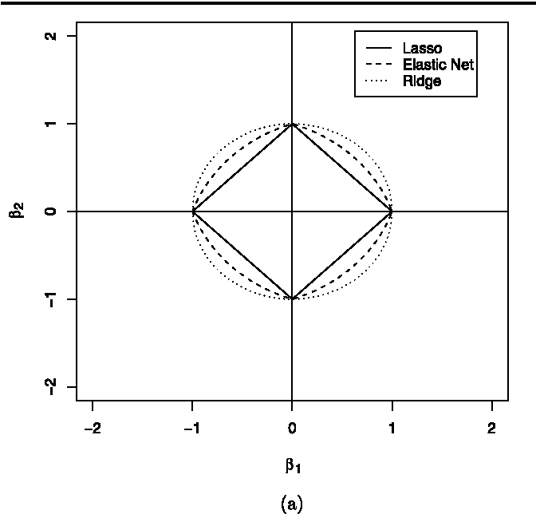

```{r style, echo=FALSE, warning=FALSE}
library("knitr")
opts_chunk$set(message = FALSE, error = TRUE, 
               warning = FALSE, cache=TRUE, comment = "")
```


# Background

The standard linear model (or the ordinary least squares method) performs poorly in a situation, where you have a large multivariate data set containing a number of variables superior to the number of samples. This is the case, for instance, of genomic, transcriptomic or epigenomic studies where the number of variables (SNPs, genes, CpGs) exceed the number of samples (i.e. transcriptomic analysis deals with ~20,000 genes on hundreds of individuals).

A better alternative is the penalized regression allowing to create a linear regression model that is penalized, for having too many variables in the model, by adding a constraint in the equation. This is also known as shrinkage or regularization methods.

The consequence of imposing this penalty, is to reduce (i.e. shrink) the coefficient values towards zero. This allows the less contributive variables to have a coefficient close to zero or equal zero. This is an assumption that holds in omic data analysis where most of the fetaures (e.g. variables) are expected to be unaltered.

The shrinkage requires the selection of a tuning parameter ($\lambda$) that determines the amount of shrinkage. This can be estimated using cross-validation. There are two main commonly used penalized regression methods, including ridge regression, lasso regression and elastic net regression. Here we illustrate how to evaluate these models in R and how to extend this to the case of dealing with big datasets.

## Ridge regression

Ridge regression shrinks the regression coefficients, so that variables, with minor contribution to the outcome, have their coefficients close to zero. The shrinkage of the coefficients is achieved by penalizing the regression model with a penalty term called L2-norm, which is the sum of the squared coefficients.

The amount of the penalty can be fine-tuned using a constant ($\lambda$). Good selection of this parameter is critial. When $\lambda=0$, the penalty term has no effect, and ridge regression will produce the classical least square coefficients. However, as $\lambda$ increases to infinite, the impact of the shrinkage penalty grows, and the ridge regression coefficients will get close zero.

Note that, in contrast to the ordinary least square regression, ridge regression is highly affected by the scale of the predictors. Therefore, it is better to standardize (i.e., scale) the predictors before applying the ridge regression, so that all the predictors are on the same scale. Normal standardization can be applied (use for instance `scale` function). In omic data this is not required since all the variables have the same nature and are usually normallized before performing data analysis. 

One disadvantage of the ridge regression is that, it will include all the predictors in the final model, unlike the stepwise regression methods are previosly peformed. In other workds, ridge regression shrinks the coefficients towards zero, but it will not set any of them exactly to zero. The lasso regression is an alternative that overcomes this drawback.

## Lasso regression

Lasso stands for Least Absolute Shrinkage and Selection Operator. It shrinks the regression coefficients toward zero by penalizing the regression model with a penalty term called L1-norm, which is the sum of the absolute coefficients.

In the case of lasso regression, the penalty has the effect of forcing some of the coefficient estimates, with a minor contribution to the model, to be exactly equal to zero. This means that, lasso can be also seen as an alternative to the subset selection methods for performing variable selection in order to reduce the complexity of the model. As in ridge regression, selecting a good value of $\lambda$ is critical.

One obvious advantage of lasso regression over ridge regression, is that it produces simpler and more interpretable models that incorporate only a reduced set of the predictors. However, neither ridge regression nor the lasso will universally dominate the other. Generally, lasso might perform better in a situation where some of the predictors have large coefficients, and the remaining predictors have very small coefficients.

Ridge regression will perform better when the outcome is a function of many predictors, all with coefficients of roughly equal size that is also a reasonable assumption in omic problems.

## Elastic Net

Elastic Net produces a regression model that is penalized with both the L1-norm and L2-norm. The consequence of this is to effectively shrink coefficients (like in ridge regression) and to set some coefficients to zero (as in LASSO). 

this methodology was developed since the use of the LASSO penalty function has several limitations.For example, in the "large p, small n" case (high-dimensional data with few examples), the LASSO selects at most n variables before it saturates. Also if there is a group of highly correlated variables, then the LASSO tends to select one variable from a group and ignore the others. To overcome these limitations, the elastic net adds a quaquadratic part to the penalty (L2-norm), which when used alone is ridge regression. 

This figure provides a visual idea of each type of penalization procedure in the naive example of having two variables




# Analysis with R


```{r load_libraries}
library(tidyverse)
library(caret)
library(glmnet)
```


We’ll use the Boston data set (from MASS package) that was used to predict the median house value (mdev), in Boston Suburbs, based on multiple predictor variables.

The methodology for all supervised methods is always the same. We require a training and a test set. When having access to two different datasets is not possible, a well stablished methodology is to randomly split the data into training set (80% for building a predictive model) and test set (20% for evaluating the model). Make sure to set seed for reproducibility.

```{r split_data}
# Load the data
data("Boston", package = "MASS")
# Split the data into training and test set
set.seed(123)
training.samples <- Boston$medv %>%
  createDataPartition(p = 0.8, list = FALSE)
train.data  <- Boston[training.samples, ]
test.data <- Boston[-training.samples, ]
```


It is important to verify that the distribution of the outcome variable is similar in both datasets

```{r check}
summary(train.data$medv)
summary(test.data$medv)
```


Then, You need to create two objects:

- `y` for storing the outcome variable
- `x` for holding the predictor variables. This should be created using the function `model.matrix()` allowing to automatically transform any qualitative variables (if any) into dummy variables which is important because glmnet() can only take numerical, quantitative inputs. After creating the model matrix, we remove the intercept that correspond to the first component in `x`.

```{r get_y_x}
# Predictor variables
x <- model.matrix(medv~., train.data)[,-1]
# Outcome variable
y <- train.data$medv
```

We use the R function `glmnet()` (glmnet package) for computing penalized linear regression models. The main arguments of the function are: 

``` 
glmnet(x, y, alpha = 1, lambda = NULL)
```

- `x`: matrix of predictor variables
- `y`: the response or outcome variable, which is a binary variable.
-  `alpha`: the elasticnet mixing parameter. Allowed values include:
    -  1: for lasso regression
    -  0: for ridge regression
    -  a value between 0 and 1 (say 0.3) for elastic net regression.
    - `lamba`: a numeric value defining the amount of shrinkage. Should be specified by the data analyst.

In penalized regression, you need to specify a constant lambda to adjust the amount of the coefficient shrinkage. The best lambda for your data, can be defined as the lambda that minimize the cross-validation prediction error rate that can can be determined automatically using the function `cv.glmnet()`.

## Ridge regression

Let us find the best `lambda` parameter using cross-validation

```{r boston_ridge}
set.seed(123) 
cv <- cv.glmnet(x, y, alpha = 0)
cv$lambda.min
```

```{r plot_boston_ridge}
plot(cv)
```

Find the final model using the best `lambda`

```{r boston_ridge_coef}
model.ridge <- glmnet(x, y, alpha = 0, 
                      lambda = cv$lambda.min)
coef(model.ridge)
```

We can evaluate the peformance of this model by using `RMSE` and `Rsquare` functions from `caret` package:

```{r boston_ridge_performance}
# Make predictions on the test data
x.test <- model.matrix(medv ~., test.data)[,-1]
predictions <- model.ridge %>% predict(x.test) %>% as.vector()
# Model performance metrics
data.frame(
  RMSE = RMSE(predictions, test.data$medv),
  Rsquare = R2(predictions, test.data$medv)
)
```


## Lasso regression
The only difference between the R code used for ridge regression is that, for lasso regression you need to specify the argument `alpha = 1` instead of `alpha = 0`


```{r boston_lasso}
set.seed(123) 
cv <- cv.glmnet(x, y, alpha = 1)
cv$lambda.min

model.lasso <- glmnet(x, y, alpha = 1, 
                      lambda = cv$lambda.min)
coef(model.lasso)
```

We can evaluate the peformance of this model by:

```{r boston_lasso_performance}
# Make predictions on the test data
x.test <- model.matrix(medv ~., test.data)[,-1]
predictions <- model.lasso %>% predict(x.test) %>% as.vector()
# Model performance metrics
data.frame(
  RMSE = RMSE(predictions, test.data$medv),
  Rsquare = R2(predictions, test.data$medv)
)
```

## Elastic net

The elastic net regression can be easily computed using the `caret` workflow, which invokes the `glmnet` package. We use `caret` to automatically select the best tuning parameters `alpha` and `lambda`. The `caret` packages tests a range of possible `alpha` and `lambda` values, then selects the best values for `lambda` and `alpha`, resulting to a final model that is an elastic net model.

Here, we’ll test the combination of 10 different values for `alpha` and `lambda`. This is specified using the option `tuneLength`. The best alpha and lambda values are those values that minimize the cross-validation error.

Let us build the model using the training set

```{r boston_enet}
set.seed(123)
model.enet <- train(
  medv ~., data = train.data, method = "glmnet",
  trControl = trainControl("cv", number = 10),
  tuneLength = 10
)
# Best tuning parameters
model.enet$bestTune
```

Parameter estimates can be obtained by:

```{r boston_param_enet}
# NOTE: best lambda must be indicated
coef(model.enet$finalModel, model.enet$bestTune$lambda)
```


We can also evaluate the peformance of this model in a test sample by:

```{r boston_enet_performance}
# Make predictions on the test data
x.test <- model.matrix(medv ~., test.data)[,-1]
predictions <- model.enet %>% predict(x.test) %>% as.vector()
# Model performance metrics
data.frame(
  RMSE = RMSE(predictions, test.data$medv),
  Rsquare = R2(predictions, test.data$medv)
)
```


# Exercise (to deliver)

--------------------

**Exercise 1:** The database `heart.csv` contains 14 variables. The "goal" of this exercise is to build a model to predict the presence of heart disease in the patient. Variable `target` contains whether the patient suffered a heart disease (value 1 ) or not (value 0). Create a predictive using lasso, ridge and elastic net regression and validate their performance using 5-fold cross-validation. 

--------------------


# Session information

```{r, echo=FALSE}
sessionInfo()
```
